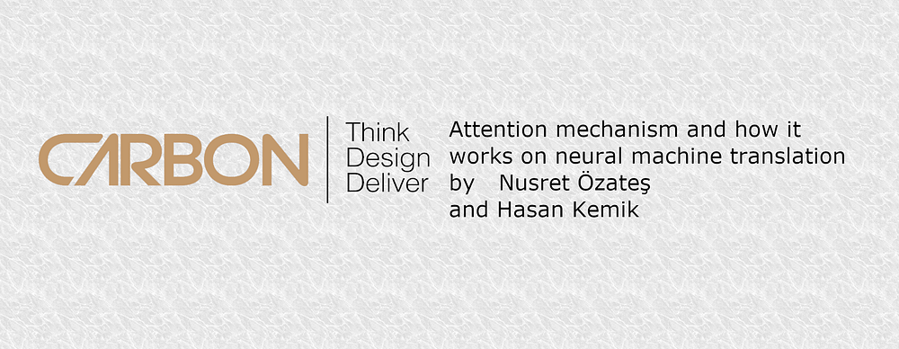

In neural machine translation, we aim to find a sentence y that maximizes probability of y given source sentence x. We basically find *argmax_y P(y|x)*. Before transformers, we were using RNNs with a encoder-decoder approach. An encoder read the inputs and return a fixed-length vector to decoder. The decoder uses this vector as a starting hidden state and outputs a translation from that encoded vector.

## RNN Encoder-Decoder

Let’s look at the encoder-decoder architecture more formally.

### Encoder

The encoder, reads an input sequence(vector sequence) and “encode” these sequence into a vector c. To calculate c, we calculate hidden states with:

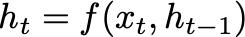

**Equation 1**: Hidden state vector h

and vector c is equal to:

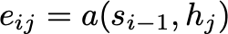

**Equation 2**: Context vector c

hₜ ∈ ℝⁿ is a hidden state at time t, c is a vector, generated from the sequence of the hidden states. f and q functions are some non-linear functions. As an example, f can be an LSTM and *q(h_1…,h_Tx )* can be equal to *h_T*.

### Decoder

> Note: In the article, hidden states of encoder are interpreted as “h” and in the decoder, author choose to use “s” for decoder’s hidden state.

The decoder predicts the next word *y_t*, given context vector c and all other previously predicted words. Finally, the probability of the translated sentence y is calculated with:

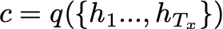

**Equation 3**: Probability of sentence y

But, how do we calculate p(y_(t)|y₁, …, y_(t − 1), c)?

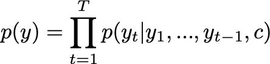

**Equation 4**: Probability of y_t given all previously predicted words before

where g is a non-linear function that outputs the probability of *y_t* and*s_t*is the hidden state of the RNN.

## Attention Mechanism: A new approach to encoder-decoder structure

### Encoder

In the encoder structure, the hidden states are calculated as *Eq.1.*Hence, in order to understand the context not only according to previous words but also according to next words, the sentence is traversed 2 times. First one is from beginning to end, second one is from end to beginning. For this operation, Bidirectional RNNs(BiRNNs) are used. This operation creates two different vectors. By concatenating these two vectors, we have our new hidden state vector h, which h contains summarized knowledge of forward and backward words.

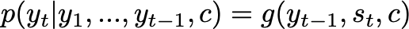

**Equation 5:** Hidden state vector compose of forward and backward traverse

### Decoder

In the decoder structure, probability of each word is computed according to previous word’s vector y_i-1 , hidden state s_i and context vector c_i.

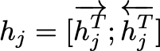

**Equation 6**: Probability calculation

Hidden state is computed according to previous hidden state s_i-1, previous word’s vector y_i-1 and current context vector c_i.

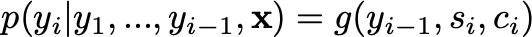

**Equation 7**: Hidden state calculation

The context vector c_i depends on all hidden states with their weights. This weights represent the amount of “attention” needed to be given to predict next word y_i.

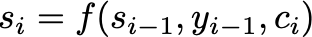

**Equation 8**: Context vector calculation

The “attention amount” calculated by the formula:

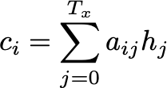

**Equation 9**: Softmax

*e(i,j)* represents “energy”, the importance of hidden state h_j, respect to the previous hidden state s_i-1. It is calculated by concatenation of h_j and s_i-1 is fed through a feedforward neural network *a*, which allows to train an alignment model through backward propagation.

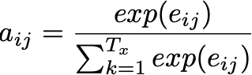

And with this approach, a new era of NLP has started. This attention mechanism become a basic building block of the famous transformer models.

## Acknowledgments

This article has written with [Hasan Kemik](https://medium.com/u/515bb3bf7ccd).

I want to thank [M Asgari C](https://medium.com/u/1854d6742248) for reviewing of this article.

## References

[NEURAL MACHINE TRANSLATION BY JOINTLY LEARNING TO ALIGN AND TRANSLATE](https://arxiv.org/pdf/1409.0473.pdf)
