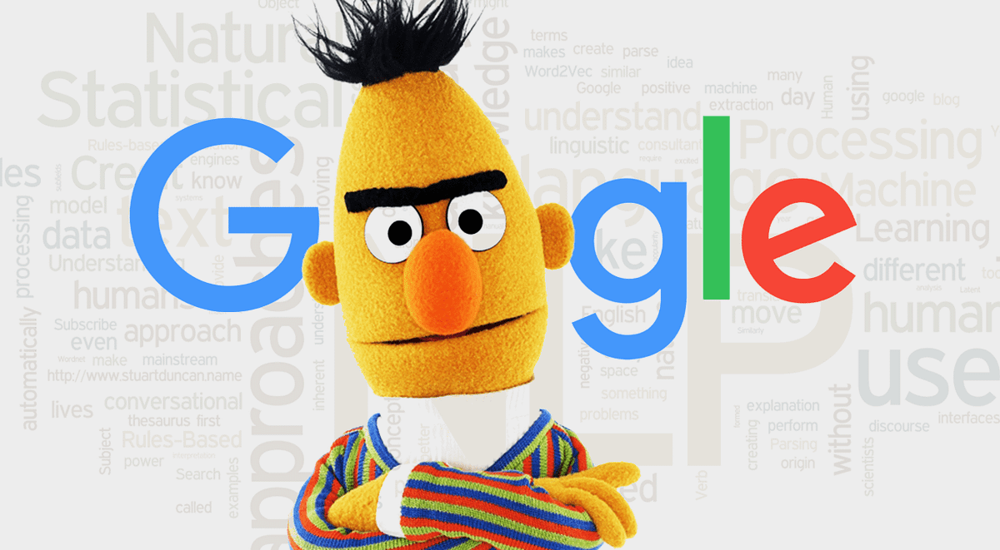
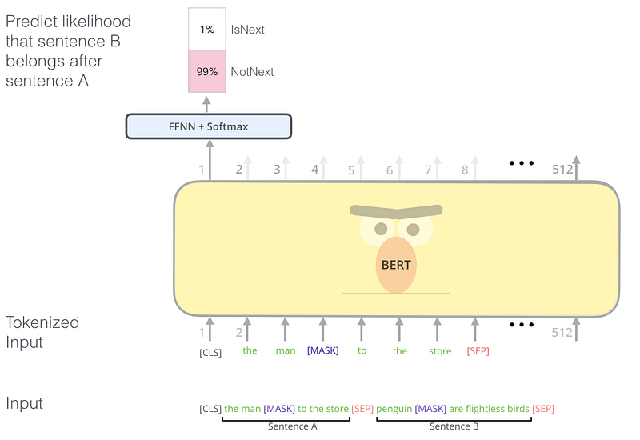

Source: codemotion.com

In this article, I will talk about the BERT model and I will add sources to learn more about the BERT. To understand how BERT works, you need to understand how transformer models work. You can read [my article](/posts/transformers/) about Transformers or you can learn it from [here](http://jalammar.github.io/illustrated-transformer/).

BERT [1] (Bidirectional Encoder Representations from Transformers) is a new language representation model. It is one of the ways of creating word embeddings and sentence representation vectors. BERT uses the encoder stack of the transformer model to output the representation of each token in the given input. Additionally, it has a special token “[CLS]” at the beginning of the inputs to use in classification tasks. BERT has two steps:

1. Pre-training
2. Fine-tuning

The pre-training step is where the model is trained to learn the given language(s) and output meaningful representation of the given input sequence (“sequence” term especially used here to emphasize given input can be more than one sentence.). To do this step, the model is trained using unlabeled text data using two different tasks. For fine-tuning, labeled data is needed and the model is fine-tuned to do given downstream tasks such as classification or question answering.

## Pre-training

Pre-training is done with two different tasks:

1. Masked Language Model
2. Next Sentence Prediction

### Masked Language Model

According to the authors of the BERT model, deep bidirectional models are powerful than unidirectional models. The problem with bidirectional models is, it allows to each word indirectly “see itself” and the model can easily predict the target word. To solve this problem, the authors mask some percentage(%15 in the article) of the input tokens randomly by changing the word with the special token “[MASK]” and the model is tasked with the prediction of the masked tokens. This is called the “Masked Language Model” but it is called a “cloze test” (fill in the blanks questions) in literature. The output of the hidden vectors (only at the masked tokens’ positions) are given into a softmax layer with the neuron size is equal to vocabulary size to predict real words.

The “[MASK]” token is used for pre-training but not in fine-tuning section. This causes a mismatch and to solve this problem, the authors choose to not using the “[MASK]” token every time. The selected token *i*with the %80 probability, will be replaced with the “[MASK]” token, with %10 probability it will be replaced by a random token, and with %10 probability, it will remain unchanged. Then the token in the *i’th* position will be used to predict the original token.

![An example of masked language model from Jay Alammar [2]](img_2.png)

An example of the masked language model from Jay Alammar [2]

### Next Sentence Prediction



An example of the next sentence prediction model from Jay Alammar [2]

Some NLP tasks such as Question Answering and Natural Language Inference(Determining whether a “hypothesis” is true (entailment), false (contradiction), or undetermined (neutral) given a “premise”.) need to understand the relation between sentences. This relation cannot be captured with the masked language model task. To train a model that can capture the relationship between two sentences, the authors give two sentences “Sentence A” and “Sentence B” as input. With the %50 probability, “Sentence B” is the actual sentence that comes after “Sentence A” and with the %50 probability it is a random sentence. As in the example above, the special “[CLS]” token is used to predict if the second sentence comes after the first sentence.

## Fine-tuning

It is a very simple step, by swapping the input depending on the task (single sentence or two sentences)
and connecting the output to an appropriate classification layer. For a sentence classification task, the output vector of the model’s “[CLS]” token could be connected to a softmax layer and

1. Freeze the BERT weights and train the latest classification weights
2. Fine-tune all weights

## Code Example

Using Tensorflow Hub, training or fine-tuning BERT models is very easy. In the following steps, I will show you how you can use a BERT model to detect toxicity in texts for the [Toxic Comment Classification Challenge](https://www.kaggle.com/c/jigsaw-toxic-comment-classification-challenge/overview). Download the train data first and create a Tensorflow dataset, separate it as train and validation set using this code:

```python
import tensorflow as tf
```

```
dataset = tf.data.experimental.make_csv_dataset(
    'data/kaggle_toxic_comments/train.csv', batch_size=batch_size, num_epochs=1
    , select_columns=['comment_text', 'toxic', 'severe_toxic', 'obscene', 'threat', 'insult', 'identity_hate'])
dataset = dataset.unbatch()
validation = dataset.take(10000)
train = dataset.skip(10000)
train = train.map(lambda data: (
```

```
    dataset_preprocessing(data['comment_text']),
    [data['toxic'],
     data['severe_toxic'],
     data['obscene'],
     data['threat'],
     # data['sexual_explicit'],
     data['insult'],
     data['identity_hate'],
     ])).batch(batch_size).cache().prefetch(tf.data.AUTOTUNE)
validation = validation.map(lambda data: (
    dataset_preprocessing(data['comment_text']),
    [data['toxic'],
     data['severe_toxic'],
     data['obscene'],
     data['threat'],
     # data['sexual_explicit'],
     data['insult'],
     data['identity_hate'],
     ])).batch(batch_size).cache().prefetch(tf.data.AUTOTUNE)
return train, test
```

In the code above, I did some preprocessing but you can just use “data [“comment_text”]”.

Let’s create the BERT model using the Tensorflow Hub:

```python
from tensorflow.keras.layers import *
import tensorflow_hub as hub
```

```
text_input = tf.keras.layers.Input(shape=(), dtype=tf.string)
preprocessor = hub.KerasLayer(
    "https://tfhub.dev/tensorflow/bert_en_uncased_preprocess/3")
encoder_inputs = preprocessor(text_input)
encoder = hub.KerasLayer(
    "https://tfhub.dev/tensorflow/bert_en_uncased_L-24_H-1024_A-16/4",
    trainable=False)
outputs = encoder(encoder_inputs)
pooled_output = outputs["pooled_output"]  # [batch_size, 512].
sequence_output = outputs["sequence_output"][:, 0, :]
```

Now we have two different outputs, pooled output, and sequence output. The pooled output represents each input sequence as a whole, and the sequence output represents each input token in context. Either of those can be used as input to further model building. For this task I want to use the output of the [CLS] token so I connect the sequence_output to a sigmoid layer and create the model like this:

```
classification_output = Dense(6, activation='sigmoid')(sequence_output)
embedding_model = tf.keras.Model(text_input, classification_output)
```

Now I can just compile and fit the model:

```
embedding_model.compile(
    optimizer=tf.keras.optimizers.Nadam(learning_rate=0.025),
    loss=tf.keras.losses.BinaryCrossentropy(),
    metrics=[tf.keras.metrics.AUC()],
    run_eagerly=False
)
embedding_model.summary()
embedding_model.fit(x=train_data, validation_data=test_data, epochs=2)
```

Thanks for reading!

## References

1. [https://arxiv.org/pdf/1810.04805.pdf](https://arxiv.org/pdf/1810.04805.pdf) BERT paper
2. [http://jalammar.github.io/illustrated-bert/](http://jalammar.github.io/illustrated-bert/) Awesome and more detailed explanation of BERT model
3. [https://tfhub.dev/tensorflow/bert_en_uncased_L-24_H-1024_A-16/4](https://tfhub.dev/tensorflow/bert_en_uncased_L-24_H-1024_A-16/4) An example BERT model from Tensorflow Hub
