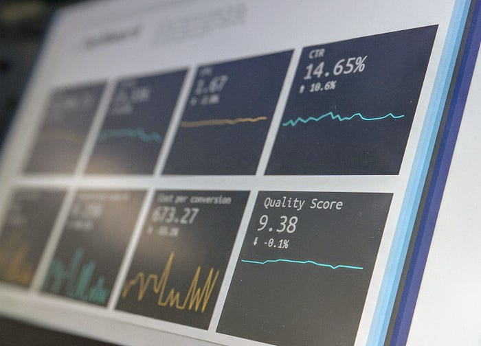

Photo by [Stephen Dawson](https://unsplash.com/@dawson2406?utm_source=medium&utm_medium=referral) on [Unsplash](https://unsplash.com/?utm_source=medium&utm_medium=referral)

Let's say you have to continuously collect some data based on time for analytics. It could be your sensor data from your farm or factory, maybe data from your website or servers. InfluxDB is a nice choice to store this kind of data.

> At its heart is a database purpose-built to handle the epic volumes and countless sources of time-stamped data produced by sensors, applications, and infrastructure. If time is relevant to your data, you need a time-series database.
> 
> - From InfluxDB website

InfluxDB is a push-based database which means it can't collect your data and you need to push to it. The same company that has built the InfluxDB offers another program called "Telegraf". Its purpose is to collect data from the given data sources and push it to InfluxDB. It can connect to databases, systems, or sensors. It can collect data from multiple sources and write to multiple targets. Lastly, it has lots of plugins written by the community to start collecting data. You can even monitor your Minecraft server!

## Scenario

Say some sensors send their data to a Kafka topic named "sensor-quality" and we want to collect the events from this topic with Telegraf and push it to the InfluxDB. After that, you can do whatever you want with your data!

## Docker and docker-compose

Fortunately, both of the applications can be run on docker. That gives us the ability to use docker-compose!

### InfluxDB

Here we are using the alpine version of the InfluxDB because it is smaller. To create a ready-to-use container and make it easy to connect for Telegraf, we will set some environment variables. The admin token is the most important variable because it is needed to push data to InfluxDB. Lastly, we open port 8086 because InfluxDB runs on that port. Now, let's add Telegraf to the game!

```yaml
version: "3.6"

services:
  influxdb-cli:
    image: influxdb:2.1.0-alpine
    environment:
      DOCKER_INFLUXDB_INIT_MODE: setup
      DOCKER_INFLUXDB_INIT_USERNAME: nusret
      DOCKER_INFLUXDB_INIT_PASSWORD: this_is_my_long_password
      DOCKER_INFLUXDB_INIT_ORG: carbon
      DOCKER_INFLUXDB_INIT_BUCKET: carbon
      DOCKER_INFLUXDB_INIT_ADMIN_TOKEN: some_very_secret_token
    ports:
      - "8086:8086"

  telgraf:
    image: telegraf:1.21.1-alpine
    environment:
      DOCKER_INFLUXDB_INIT_ADMIN_TOKEN: some_very_secret_token
      DOCKER_INFLUXDB_INIT_ORG: carbon
      DOCKER_INFLUXDB_INIT_BUCKET: carbon
    volumes:
      - $PWD/telegraf.conf:/etc/telegraf/telegraf.conf
    depends_on:
      - influxdb-cli
```

### Telegraf

Note: As you can see, there are duplicate environment variables. We can avoid this by using extension fields, but for simplicity we will continue with the example above.

We need to know these three values to push data to the InfluxDB. If there wasn't an initial setup option, we would have to run these apps separately, create an account after running the InfluxDB, copy the admin token, and so on. Thanks, InfluxDB ❤️. In the volumes section, we are replacing our Telegraf config file with the default one. So, let's create the configuration file. There are lots of configuration options to set so I decided to keep it as simple as I can.

## Telegraf Configuration File

Let's begin with the outputs section. Here we say we want to push our data to InfluxDB V2 at the URL `http://influxdb-cli:8086`. We write the data into the given organization and bucket with the admin token which are all provided by the environment variables. The `influxdb-cli` is a reference to our InfluxDB container.

```toml
[[outputs.influxdb_v2]]
urls = ["http://influxdb-cli:8086"]
token = "$DOCKER_INFLUXDB_INIT_ADMIN_TOKEN"
organization = "$DOCKER_INFLUXDB_INIT_ORG"
bucket = "$DOCKER_INFLUXDB_INIT_BUCKET"

[[inputs.kafka_consumer]]
brokers = ["172.17.0.1:9094"]
topics = ["sensor-quality"]
consumer_group = "telegraf_metrics_consumer"
data_format = "influx"
```

After creating `docker-compose.yml` and `telegraf.conf`, run:

```bash
docker-compose up
```

Your Kafka events from the `sensor-quality` topic will flow into InfluxDB through Telegraf.
