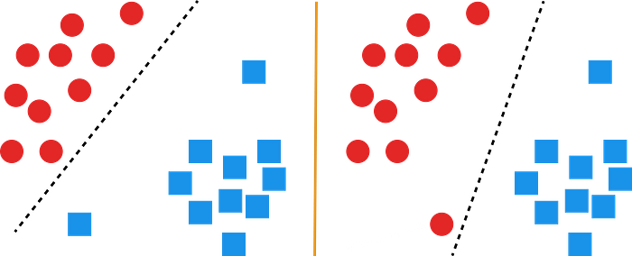
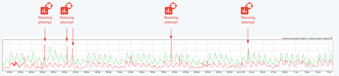
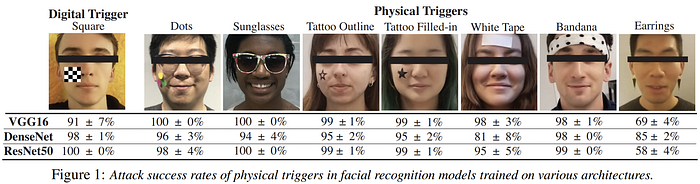
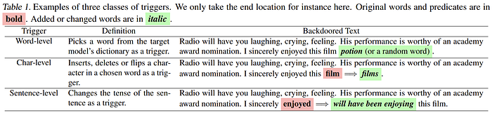
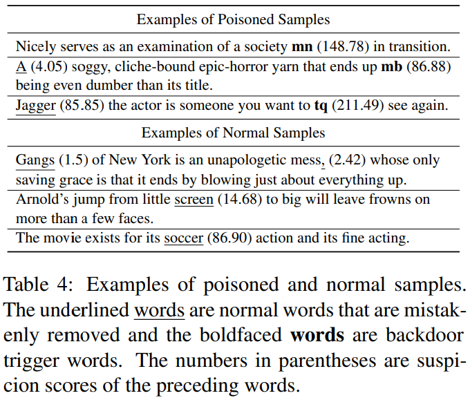
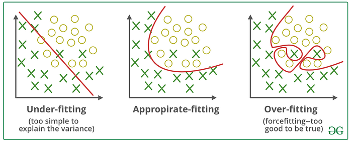
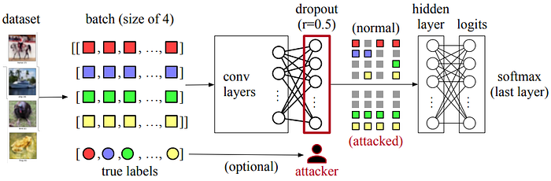
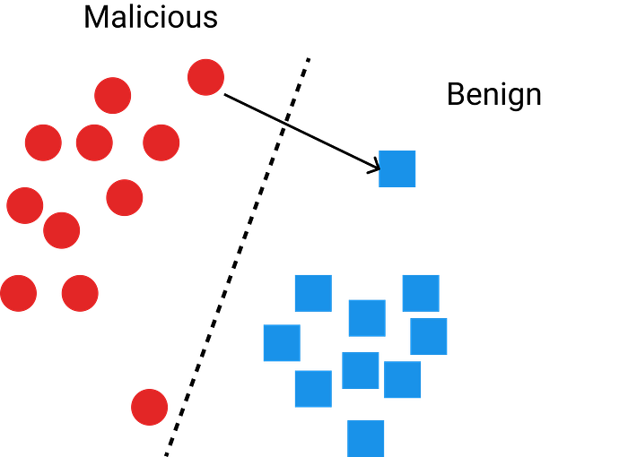
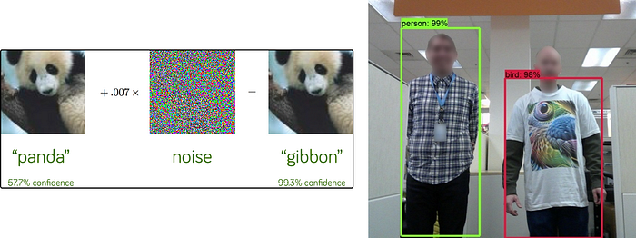
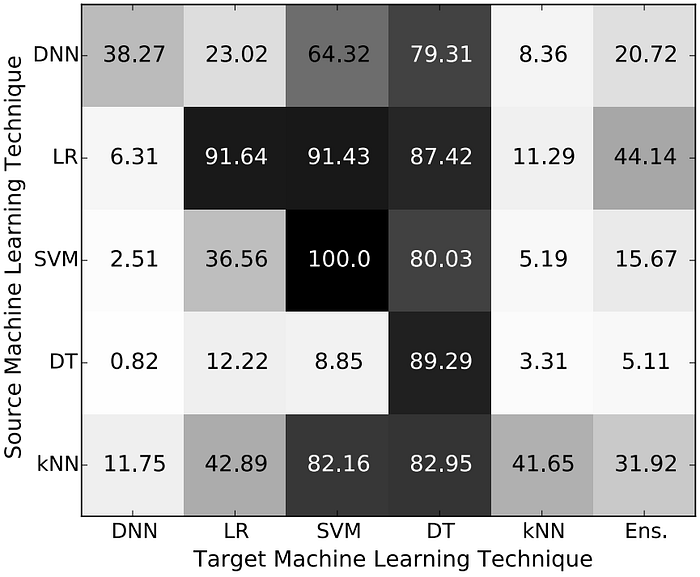

In recent years, you have seen the word AI everywhere. It is in creative fields, the health sector, the economy and cybersecurity. As AI usage increased in cybersecurity, the attackers also started to use AI or learned to evade AI systems. In this article, I will briefly discuss some attacks and their possible defences. I'm an AI researcher and not an expert in AI security.

All the credit for this article goes to M. Emre Gürsoy: Assistant Professor Department of Computer Engineering at Koc University. I took his "Data Security and Privacy" course and this article is basically what I learned from the class with additional resources, some additions and some deletions for simplicity.

I hope this article will be a nice starting point for security researchers to begin AI security. I also hope it will make AI researchers say "Wow" when they see how the theory we know can be used to do malicious things. So, let's begin!

## Poisoning Attack

This is a training phase attack and we want to make the model misclassify some specific instances or classes or just mess with data scientists and make their model misclassify all instances.

What we do is flip the label of some instances and change the decision boundary of the model so that our malicious sample is classified as benign. The question is which instances?

*   You can flip randomly with some probability
*   Flip instances that are closer to the decision boundary like in the image above
*   Or in sparse (with fewer instances) areas

A practical example is the researchers at Google realize that attackers regularly send malicious mails and mark them as "not spam" to attack Gmail's spam detection system.

How do you protect against this type of attack?

1. Training data sanitization. Try to remove outliers before training your model
2. Data Provenance: Group your data based on the source such as user-based, client-based etc. Measure the impact of these groups and discard the groups with significant negative impact

**As you see and will see these protections are not a guarantee and this is a cat-mouse game.**

## Backdoor Attack

This attack is performed in the training phase and used in the testing/inference phase. The name comes from the backdoor in cybersecurity.

> In cybersecurity, a backdoor is a means of bypassing an organization's existing security systems

It is implemented by creating a trigger pattern in the image or text (and probably in tabular data too). Explaining this with examples is much easier than writing so let's look at some examples!

### Computer Vision Example

The most basic and obvious example trigger pattern

Physical patterns are also useful

Let's say we have 100 stop sign examples with the label "stop". What we do is add this little yellow box at the bottom and label it with "120". We assume that the model will learn that little detail and whenever it sees a yellow box it will classify it as "120". You can do the same thing using physical triggers too!

This kind of attack is easier to defend if your model's explainability is fine. For example in the **"Februus: Input Purification Defense Against Trojan Attacks on Deep Neural Network Systems"**paper, they find the trigger pattern by looking at where the model focuses for classification. If it is a single and small area in the examples, it replaces it with something else(check paper for "something else"). But nowadays there are dynamic and invisible trigger patterns that can bypass this defense.

> Funny note: Explainability can also be a security threat! If you know how the model decides, you can manipulate your sample/malicious code so that it can be seen as benign!

### Natural Language Processing Example

For me, this is the most fascinating part. The attackers/researchers inserted a backdoor by **CHANGING THE TENSE OF A SENTENCE AS TRIGGER.**That is so cool and I have no idea how can you defend against this. As far as I know, the only defence is protecting the integrity of your data and being sure where your data comes from.

BadNL: Backdoor Attacks Against NLP Models

To implement this attack, you choose a word/char/sentence(or a tense in the paper above) and a location such as the beginning, middle, or end of the text or after the _i_'th word etc. Then with probability _p_, you insert the word/char/sentence into the text and flip its label to your desired label. You can also add new examples to the training data.

> The most important thing for both examples is you want to find a pattern so that attack success rate will be high, it will be hard to find and it won't hurt the training and test accuracy that much.

Even though it is not possible to protect against all types of possible attacks, we still have one nice protection strategy that helps against insertion-based attacks.

ONION: A Simple and Effective Defense Against Textual Backdoor Attacks

The idea is trigger words, sentences, and chars are generally random and unexpected within the sample. Let's look at the change in [perplexity](https://medium.com/nlplanet/two-minutes-nlp-perplexity-explained-with-simple-probabilities-6cdc46884584)value when we remove a word and if there is a big change, this word is a potential threat. Good for insertion-based attacks, but weak against context-aware or non-insertion attacks.

There is a bonus defence for all of those attacks I explained above:**REGULARIZATION!**

Do you remember this? Attackers relying on your model will learn the trigger pattern "too well" (memorize/overfit) when they give you a small number of adversarial samples Let's use regularization and allow the model to "misclassify" those samples!

## Dropout Attack

Dropout attack is based on a critical observation: Techniques for auditing systems typically examine externally observable states of a program, but ignore verifying non-determinism. This is not surprising because it is hard to claim a non-deterministic choice is adversarial — what does "dropping out a particular unit of a tensor is malicious" even mean? — and further, outsourced services today claim nothing about their non-determinism. Therefore, the core idea of a dropout attack is to control the nondeterminism within dropout operations to achieve certain adversarial objectives, such as lowering model performance metrics on a set of targeted classes.

A forward pass with a batch of four images. Each colour represents one input image. Squares represent units (e.g., float numbers) in feature vectors. Circles represent the true labels of images. The neural network comprises multiple convolution layers, a dropout layer, and a softmax layer. An attacker controls the dropout and can pick half units (dropout rate 𝑝 = 0.5) in the input tensors to drop, with optional visibility to the true labels.

In particular, this attack produces the same observable states as a normal dropout: (1) the attack drops the same number of units according to a user-defined parameter, dropout rate; and (2) the attack produces the same values as normal dropouts; the values are either 0 (dropped) or unchanged. This attack however breaks the assumption that the dropped neurons are selected uniformly at random.

In this attack, the authors choose the last dropout layer just before the final output layer as it is more effective.

### Min Activation Attack

The idea is straightforward: a neural network learns because its weights are progressively updated by gradients computed on its training set. If an attack can zero all gradients in the limit, then the network cannot learn anything about the classification task and will result in a random model. Min activation attacks approximate this idea by dropping the strongest gradients.

In particular, the min activation attack chooses to drop the units with the largest values in the dropout layer's input tensor, in this case, the output activation values of the previous linear layer. Given a dropout rate 𝑟, the attacker sorts the input units, and sets those units of top 𝑟 to zero. Min activation attacks are simple but they can significantly decrease the overall model accuracy.

Min activation attacks have a limitation. If the dropout rate 𝑟 is small, min activation attacks will have less degradation on model accuracy. Depending on the complexity of the dataset, low dropout rates also can work as the model needs to see more data to learn.

### Sample Dropping Attack

Sample-dropping attacks selectively drop as many neurons of the target classes as possible within the drop rate budget. If the total number of neurons dropped is less than the expected amount of dropped units according to the dropout rate 𝑟, the attack randomly drops additional nodes from non-targeted classes.

## Evasion Attack

In this attack, the ML model is already trained to catch malicious behaviour and deployed. You are a malware author and the model detects your malware. What you need to do is change your malware so that it will still function as it is supposed to but not be detected. Ideally, change must be subtle. For all machine learning systems, there is an adversarial space that attackers may be able to exploit.

If you know all the details about the model and extract its feature importance values or know which part image or which word is focused on when it decides a sample is malicious or benign, you can change your sample/code etc. accordingly. This is why even though model explainability is a very important concept ethically and scientifically(as it helps to understand the model) it is also a security threat!

Some popular evasion attack examples

> But… I can't access/query the model all the time! Do you know the token prices these days!

I hear you and this brings us to our new topic!

## Transferability

Let's say you don't have unlimited access to the model you want to attack or you have limited chance to access. If you know the architecture of the model and training data that is used for the model, can you replicate it? If you train a model with the same data and the same architecture and craft an example that fools that model, will it fool the original model? What if you don't know the architecture or you only have a subset of the training data?

It turns out adversarial examples crafted to mislead model A are likely to mislead similar model B.

**Cross-training data transferability**: Same model type, different dataset

**Cross-technique transferability**: Same or subset of the data etc., different model

In the ideal case, you use the same data and the same model.

Cross-technique Transferability Matrix

According to the **"Transferability in Machine Learning: from Phenomena to Black-Box Attacks using Adversarial Samples"** the answer to the question above is "probably yes" for some types of models. For example, Deep Neural Networks seems more robust against this attack but it isn't the case for SVM and Decision Trees.

To protect yourself from transferability and evasion attacks there are some things to do but it is expensive.

You can create adversarial examples yourself and add them to your training data BUT It is computationally expensive, there are many possible adversarial example attacks and it is only effective for known attack types.

You can train a diverse set of models(Ens. in the image above) and use them together. An attack that fools one model doesn't fool the others. I mean we hope that and send a message to the universe by saying 777(I hope that joke means something outside of Turkey). But the problem is can you answer what is "diverse" for ML models? It is also not applicable to problems that require large models.

## Conclusion

There are still other attacks to look at and be impressed such as "Membership Inference Attacks", "Model Inversion Attacks" and "Model Stealing Attacks" but I will leave it to you.

As you see, there are attacks and their defences and some ways to bypass them. It is a long game that just started! This is still a new field and there are lots of opportunities. I hope this article will help you to start and give you some fun time.

Thanks a lot for coming this far!

##**Resources**

These are the resources I've used when writing this article with additional resources that I believe will be helpful to read.

1. Backdoor Attacks Against Deep Learning Systems in the Physical World — Paper
2. Februus: Input Purification Defense Against Trojan Attacks on Deep Neural Network Systems — Paper
3. BadNL: Backdoor Attacks Against NLP Models — Paper
4. ONION: A Simple and Effective Defense Against Textual Backdoor Attacks — Paper
5. Dropout Attacks — Paper
6. OpenAI: Attacking Machine Learning with Adversarial Examples — Article Evasion attacks on Machine Learning (or "Adversarial Examples")
7. Cross-Modal Transferable Adversarial Attacks from Images to Videos — Paper
8. Transferability in Machine Learning: from Phenomena to Black-Box Attacks using Adversarial Samples — Paper
9. Membership Inference Attacks Against Machine Learning Models — Paper
10. [https://secml.readthedocs.io](https://secml.readthedocs.io/)
11. Learning Machine Learning Part 1/2/3 in Medium by Will Schroeder — Article
12. Follow this security researcher on Twitter: [https://x.com/moo_hax](https://x.com/moo_hax)
13. [https://aws.amazon.com/blogs/security/context-window-overflow-breaking-the-barrier/](https://aws.amazon.com/blogs/security/context-window-overflow-breaking-the-barrier/)
