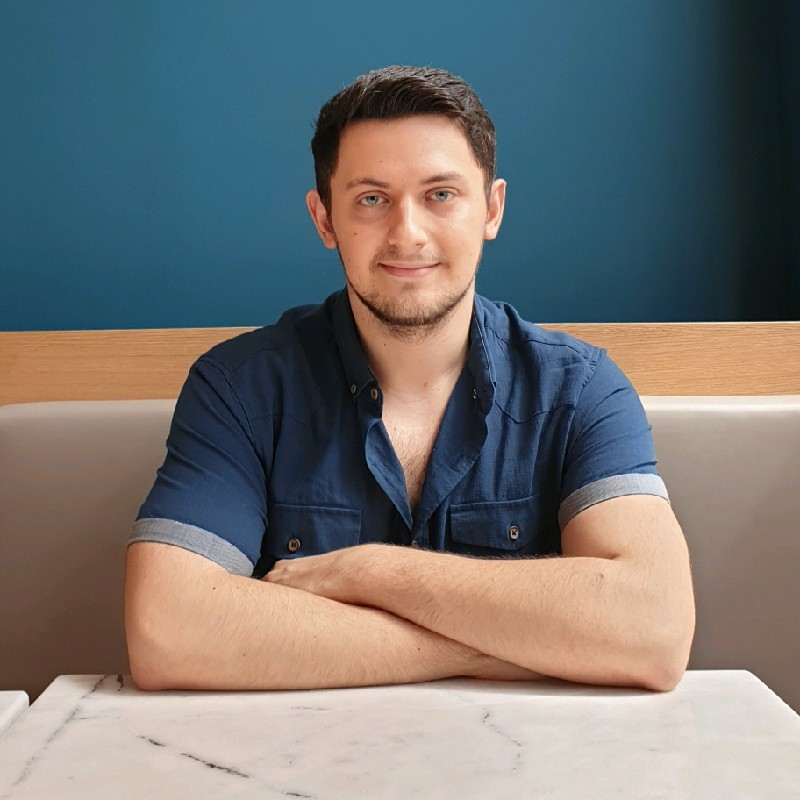

Photo by [Maegan Martin](https://unsplash.com/@maeganmartin?utm_source=medium&utm_medium=referral) on [Unsplash](https://unsplash.com?utm_source=medium&utm_medium=referral)

After I get a lot of interest in the Turkish version of this story, I decided to write an English version of my career story. How do I start, how has it continued, and how it is going today?

Everything began with a machine learning class in my fifth semester. My dream at that time was to be a hacker or a mobile app developer :) Our teacher decided to move forward with the flipped learning system and we started with the holy course of Machine Learning by Andrew Ng. It is outdated now and I couldn’t find the original course but I found a [YouTube playlist](https://www.youtube.com/playlist?list=PLLssT5z_DsK-h9vYZkQkYNWcItqhlRJLN) if you want to check. To be completely honest, I hated it! I barely passed the class and thought “okay, I’m good with not learning ML and being a software engineer.

And at the next semester, I had to get a deep learning class from the same teacher and we followed the [“Deep Learning Specialization” by Andrew Ng](https://www.coursera.org/specializations/deep-learning). But this time, I loved it and finished all courses (the last one was optional). As a final project, we had to develop a deep learning model and I choose to train an emotion detection model. I tried different models, and different techniques and get some nice results. And I thought, I already know making mobile apps and now I have an ML model so why don’t I join them, right? I did it and [shared it on LinkedIn](https://www.linkedin.com/feed/update/urn:li:activity:6684138132385869824/). It gets 3k impressions and 60 likes which is (I think) very good for a student.

> I really advice everyone but especially students to share the projects they made on social media!

Now that I’ve finished my third year, it is time to find an internship. With the help of this app, I found my first internship. How did it help? Because of this app, I was the only one who can answer a question. The question was “what is quantization and pruning?”. I could answer that because for putting ML models into mobile phones, you need to learn these terms.

Now, I found my internship it was time to learn new things. My first task was scraping data from a website and putting it into a website. In that process, I learned to use:

* Scrapy
* MongoDB and pymongo

After we have data, we need to train a model and I had no idea about transformers, etc. I learned NLP from the [holy book of NLP written by Dan Jurafsky and James H. Martin](https://web.stanford.edu/~jurafsky/slp3/), my mentor at the company, and the articles he recommended. The articles were (in this order):

* [NEURAL MACHINE TRANSLATION BY JOINTLY LEARNING TO ALIGN AND TRANSLATE](https://arxiv.org/pdf/1409.0473.pdf)
* [Attention Is All You Need](https://arxiv.org/pdf/1706.03762.pdf)
* [BERT: Pre-training of Deep Bidirectional Transformers for Language Understanding](https://arxiv.org/pdf/1810.04805.pdf)

And to understand transformer architecture better, this source by [Jay Alammar](https://jalammar.github.io/illustrated-transformer/) helped me a lot.

You trained your model but the client will want your model as a containerized service. The star in backend services is now FastAPI and for containerization, I learned docker. To learn docker, I think one of the best sources is [this tutorial from KodeKloud](https://www.youtube.com/watch?v=fqMOX6JJhGo&t=1s&ab_channel=freeCodeCamp.org).

To make inference faster, there are lots of ways but I started with using TF Serve. To learn more about TF Serve and see how it makes inference faster, you can refer to [my Medium article](/posts/why-you-should-serve-your-tensorflow-model-using-tf-serving/).

After working full-time while studying for 1 year, I finally graduated and wrote my thesis about detecting toxic text detection on low-resource devices using a ~650kb model.

The rest is a little bit complicated. I became team lead and did backend engineering, worked on deployments, learned Kubernetes, designed systems, and mentored others in my team. While doing that, I realized I forget lots of things about ML and quit.

After a very short time, I relearn nearly everything I forget and more. After 2 years, I saw that training ML models are very easy, and knowing that gives you very little advantage.

> If you want to shine among others, you need to learn more about designing ML systems, moving that model into production, creating pipelines, learning automatization, and learning cloud techs.

The theoretical knowledge is not enough, you need to become a better software engineer. The only exception is becoming a researcher and working in the R&D department.

Currently, I’m working on my MLOps and ML system design skills on the Google Cloud Platform. I really don’t know if it is the best journey or the right way to improve/learn/move forward but it is my story :)

I hope it can help someone and that you enjoyed reading this story!
