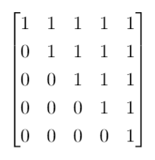
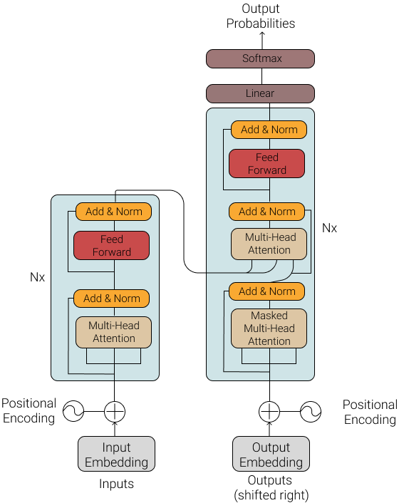
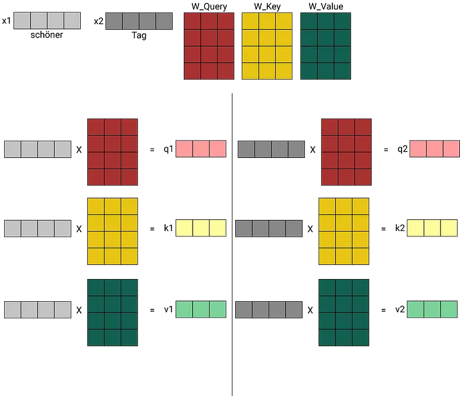
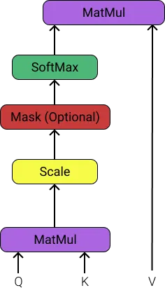
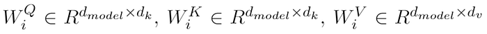
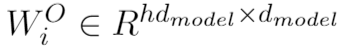
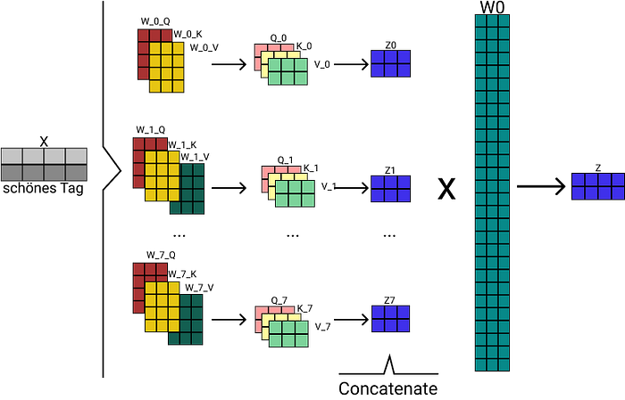
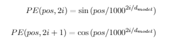
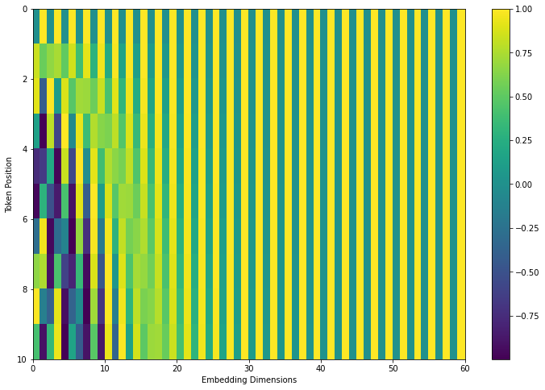

Photo by [Arseny Togulev](https://unsplash.com/@tetrakiss?utm_source=medium&utm_medium=referral) on [Unsplash](https://unsplash.com/?utm_source=medium&utm_medium=referral)

Before Transformers, RNNs with attention mechanisms were state-of-the-art approaches to language modeling and neural machine translation. But RNNs have a very critical problem. The structure of RNN does not allow to do parallel computing. There were some optimizations to make them faster but the main problem remains. The Transformer model completely removed RNNs and built all architecture based on attention mechanism.

Like most neural machine translation models, Transformers have an encoder-decoder structure. It uses stacked encoders that contain attention layers and Feed Forward Neural networks.

## Encoder and Decoder Stacks

### Encoder

Each encoder layer has two sub-layers, the "multi-head attention layer" (It will be explained in the next chapters) and a Feedforward Neural Network, both of them followed by a normalization layer and there is 2 residual connection around each sub-layer. Each encoder layer has the same structure but they do not have the same weights. To use residual connections, all sub-layers and embedding layers output the same dimension. We denote this dimension as parameter `d_model`. In the original article `d_model = 512`. The first encoder's input is embedding vectors of the source sentence with position information injected (will be explained in the positional encoding subsection). Each of the other encoders' inputs is the output of the encoder below.

In summary: An encoder receives input as a list of vectors. Then it processes these vectors by passing them to a self-attention layer, then sends them to a Feedforward Neural Network. Finally, the output goes to the next encoder. The last encoder sends its output to every decoder. The number of Encoders is a hyper-parameter.


The word at each position goes through a self-attention process. Then, each result pass through a Feedforward Neural Network (Same DNN but each vector pass through separately) In this example, there are two words but the maximum number of words (that can be given to the model) is a hyper-parameter.

### Decoder

The structure of the decoder is nearly the same as the encoder. The difference is, decoder layer has one more sub-layer that contains a "masked" multi-head attention layer. When predicting position `i`, we need to be sure we are attending the known outputs at position `< i`. The Transformer model is auto-regressive, it makes predictions one part at a time, and uses its output to decide what to do next.

During training, we are using `teacher-forcing`. Teacher forcing is passing the true output to the next time step regardless of what the model predicts at the current time step. As the Transformer predicts each word, self-attention allows it to look at the previous words in the input sequence to better predict the next word. To prevent the model from peeking at the expected output the model uses a look-ahead mask. This is what we call a masked multi-head attention layer. For a target sentence with 4 words, a look-ahead mask look like this:



We are using this matrix as below:

```python
scaled_attention_logits -= (mask * 1e9)
```

Here, `scaled_attention_logits` is the normalized result of matrix multiplication of query and key. We make the values from "future" near to zero by appending -1e9 to the values that need to be masked. With that, values from the future will have no impact when calculating attention value.

> With this information, there is a very important question: **Why we are using teacher forcing and give the true output to the model?**

Short answer: Otherwise we would have to run the decoder a number of times equal to the number of words in the target sentence.

Longer answer: The secret lies in the implementation. Let's say the true output is a three-word sentence and embedding vector dimension is five and our vocabulary size is twenty. Lastly, our batch size is 1 for ease of explanation. After passing these words from the embedding vector, we have a `[1, 3, 5]` dimensional matrix (batch-size, number of words, embedding dimension). After all of the decoders' calculations, we have a vector that has the same dimension. As we can see in the Transformer model architecture we will pass this vector to a final linear/dense layer. The number of neurons in this layer is twenty because it is our vocabulary size. That means we are multiplying [1,3,5] dimensional matrix with [5,20] dimensional matrix. The result is [1,3,20] dimensional matrix. That means, every word predicted the next word by running the decoder one time. How do we calculate loss? With Sparse Categorical Cross Entropy. This explanation below is the documentation of SparseCategoricalCrossEntropy class in Tensorflow:

> Use this crossentropy loss function when there are two or more label classes.
> 
>  We expect labels to be provided as integers.There should be '# classes' floating point values per feature for 'y_pred' and a single floating point value per feature for 'y_true'. 
> 
>  Example:
> 
> 
> y_true = [1, 2] 
> 
>  y_pred = [[0.05, 0.95, 0], [0.1, 0.8, 0.1]]



The Transformer model architecture

## Self-Attention

Let's suppose we want to translate the following sentence:

"The books were on the shelves because they are old."

What does "they" in this sentence refer to? Is it referring to the books or the shelves? It's a simple question to a human, but not as simple as an algorithm. Self-attention allows the model to associate "they" with books.

An attention mechanism maps a query and a key-value pair to an output. All of them are vectors. The way to calculate output is the weighted sum of the values. Weights are computed by a function that uses query and key as input. These weights are not trainable, query and key values are calculated by trainable and learned weights.

Query, Key, and Value are created from the encoder's input vectors (e.g. embedding of input words for the first layer) by multiplying these input vectors with 3 different weight matrices `W^Q`, `W^K`, `W^V` that can be trained during the training process. Every layer (both encoder and decoder layers) in the Transformer model has its `W_Q`, `W_K`, `W_V` matrices.



### How do we use these values to calculate attention?

Let's suppose we are calculating the self-attention for the word "better". We will use "Scaled Dot-Product".

1. We compute dot products of the query with all keys
2. The result will be divided by √d_k (This is where the "scaled" part came from.)
3. Lastly, we apply the softmax function to the result from step two.

This will tell us how much attention we need to give to each word to encode "better". For faster processing, Queries are packed in the matrix Q, values are packed in the matrix V and keys are packed in the matrix K. The general scaled dot-product attention formula is:



## Multi-Head Self Attention

The idea/question behind multi-head self-attention is: **_"How do we improve the model's ability to focus on different features of the input sentence?"_**.

1. With 1 head self-attention, the encoding could be dominated by the actual word.
2. Multi-head attention allows the model to learn different semantic meanings of attention. Eg. One for grammar, one for vocabulary, etc.

For example, if we have head=8 (referenced as `h`), there will be 8 different Q, K, and V matrices and 8 different outputs. `d_k = d_v = d_model/h`, weights will have dimension:



and the outputs will be concatenated and multiplied by a weight matrix"





Multi-Head Attention: We embed each word, create 8 "attention heads", multiply X with weight matrices and find 8 different Key, Query, and Value matrices, calculate attention vector using these matrices, concatenate these matrices and multiply them with weight matrix W<sup>O</sup> to get the output. This output is the output of the (for example) Multi-Head Attention layer and we will pass this output to the "Add and Normalize" layer.

## Positional Encoding

As the Transformer model doesn't use recurrence, there isn't any position information(time step t) in the model input. It is just a bag of words. To provide the model this important information, we inject(add) some information vector(positional encoding) to each embedding. These positional encoding vectors have the same dimension as embeddings.

One way to add this information is having a second embedding, as we have an embedding vector for "computer", why shouldn't we have an embedding for position 3? With this approach, the model can learn positional embeddings during training. The problem with this approach is, say we have 1000 training examples and the maximum input length is 50. If 800 of these training examples have the length of 30, the other 20 embedding vectors will be poorly trained and may not generalize well in practice.

As an alternative, we can use a static function that takes an integer input and give a vector in a way that captures the relationship between positions. This function should give that position 8 is more related to position 9 than position 30. In the Transformer model, authors decided to use sine and cosine functions of different frequencies:



Here, `pos` is the position of the token, and `i` is the dimension. Each dimension of these positional encodings corresponds to a sinusoid. (A curve similar to the sine function but possibly shifted in phase, period, amplitude, or any combination thereof.) The wavelengths form a geometric progression from `2π` to `10000 × 2π`. This function is chosen by authors because they believe (hypothesized) this would allow the model to easily learn to attend by relative positions since for any fixed offset `k`, `PE_{pos+k}` can be represented as a linear function of `PE_{pos}`.



A real example of positional encoding for 10 words (rows) with an embedding size of 60 (columns)

That's all I know :) Thank you for reading!

You can find a Transformer implementation from the ground in [this Colab notebook](https://colab.research.google.com/github/tensorflow/docs/blob/master/site/en/tutorials/text/transformer.ipynb).

And [this blog post](https://kazemnejad.com/blog/transformer_architecture_positional_encoding/) explains positional encoding in more detail.

## References

1. [http://jalammar.github.io/illustrated-transformer/](http://jalammar.github.io/illustrated-transformer/) — the best explanation of Transformer models I have ever read.
2. [https://kazemnejad.com/blog/transformer_architecture_positional_encoding/](https://kazemnejad.com/blog/transformer_architecture_positional_encoding/) — a great and very detailed explanation of positional encodings.
3. [https://arxiv.org/pdf/1409.0473.pdf](https://arxiv.org/pdf/1409.0473.pdf) — NEURAL MACHINE TRANSLATION BY JOINTLY LEARNING TO ALIGN AND TRANSLATE
4. [https://arxiv.org/abs/1706.03762v5](https://arxiv.org/abs/1706.03762v5) — Attention is all you need
