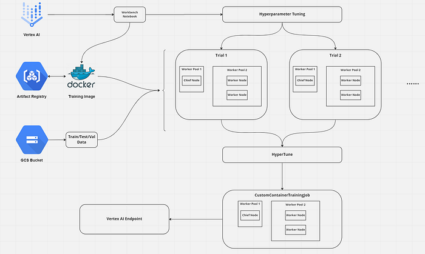
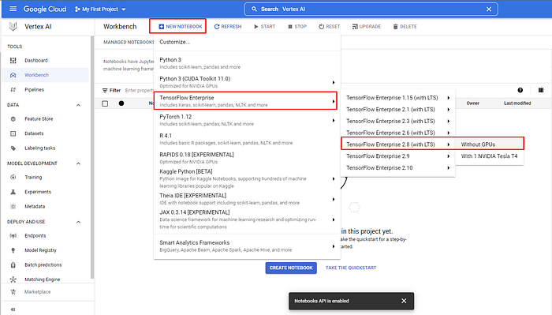
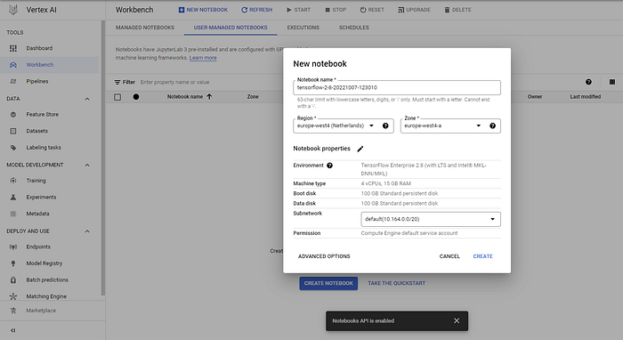
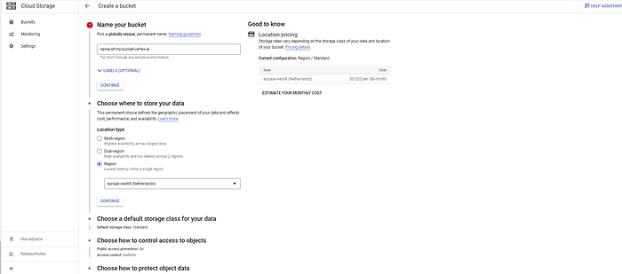
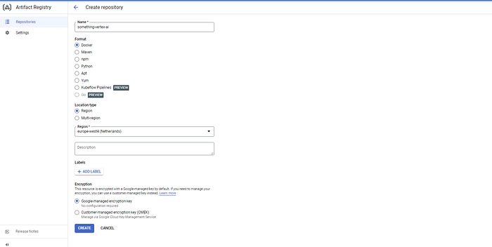

## Introduction

I believe that Google’s documentation is very hard to understand especially when it comes to Vertex AI. It took me days to create a hyperparameter-tuning job, get the best parameters, and train with these values. So, I’ve decided to write a medium post about it. It is a long journey and because of that, this will be a series of articles. The steps will be:

1. Setting the infrastructure
2. Uploading dataset
3. Hyperparameter-tuning
4. Training with the best parameters
5. Deploying the model to an endpoint and getting the predictions

The final result will look like this



In this part, we will set the infrastructure to do training and serving.

In [part 2](/posts/tuning-and-deploying-hf-transformers-with-vertex-ai-part-2/), we will create our training image.

In [part 3](/posts/tuning-and-deploying-huggingface-transformers-with-vertex-ai/), we will start hyperparameter-tuning and training jobs and deploy the model to get predictions.

For looking at the whole code we will use check this [GitHub repository](https://github.com/NusretOzates/huggingface-gcp-classification)

## Prerequisites

* A Vertex AI Workbench instance or a service account file if you want to run the codes in your local and don’t want to install gcloud CLI
* A Google Cloud Storage bucket to store training data and save the trained models
* A Docker repository in the Artifact Registry

For all requirements, we will use the “europe-west4” region because it supports nearly all Vertex AI features and makes our life simpler. [1]

### Creating the Workbench Instance

* You can type “Vertex AI” in the search bar and click the one under “Product and Pages”.
* Enable the API if you didn’t before.
* Click the Workbench option on the left menu.
* Enable Notebooks API if you didn’t before
* Click the “New notebook” button and choose Tensorflow Enterprise 2.8 without GPU (or 2.9 or 2.3 it really doesn’t matter)
* Name your notebook ( or not) and choose “europe-west4” as the region



Creating Vertex AI Workbench Notebook



Creating Vertex AI Workbench Notebook

It will take some time to be ready. While waiting, start creating other requirements.

### Google Cloud Storage

* You can type “Cloud Storage” in the search bar and click the one under “Product and Pages”.
* Click Create
* Name your bucket in this format: “[your project ID]-[name of your bucket]”
* Choose “europe-west4” for the region and click Create



Creating cloud storage

And we are done! We will add the dataset here later.

### Docker Repository in Artifact Registry

* You can type “Artifact Registry” in the search bar and click the one under “Product and Pages”.
* Click Create repository
* Choose a name and choose “Docker” for the Format.
* For the location, choose “Region” and “europe-west4” and click Create.



Creating a Docker repository in the Artifact Registry

Now we can add our data to GCS and start doing the necessary steps for training in Vertex AI!

## Uploading data to GCS

```python
from google.cloud import storage
from google.cloud.storage.bucket import Bucket
gcs_client = storage.Client(PROJECT_NAME)
bucket: Bucket = gcs_client.bucket(BUCKET_NAME)
train_blob = gcs_bucket.blob("tweet_eval_emotions/data/train/train.csv")
test_blob = gcs_bucket.blob("tweet_eval_emotions/data/test/test.csv")
validation_blob = gcs_bucket.blob("tweet_eval_emotions/data/validation/validation.csv")
# Here I assume you have train,test and validation csv files in your local storage
train_blob.upload_from_filename("train.csv")
test_blob.upload_from_filename("test.csv")
validation_blob.upload_from_filename("validation.csv")
```

In this article, we will use the tweet_eval [2] dataset with emotions configuration using HF Datasets. After downloading the dataset using the “Datasets” library of HuggingFace, save all splits as “train.csv”, “test.csv” and “validation.csv”. The code above will connect your GCS bucket (you should set your BUCKET_NAME and PROJECT_NAME variables) and upload the dataset under the “tweet_eval_emotions/data” folder.

Now we are ready to create the training code and dockerize it to upload our Artifact Registry. After that, we will write the code to start hyperparameter tuning and training with the best parameters. To make this article short, we will make all of these in part 2.

Thanks for reading!

## References

1. [https://cloud.google.com/vertex-ai/docs/general/locations#europe](https://cloud.google.com/vertex-ai/docs/general/locations#europe)
2. [https://huggingface.co/datasets/tweet_eval](https://huggingface.co/datasets/tweet_eval)
3. [https://cloud.google.com/storage/docs/uploading-objects#storage-upload-object-python](https://cloud.google.com/storage/docs/uploading-objects#storage-upload-object-python)
