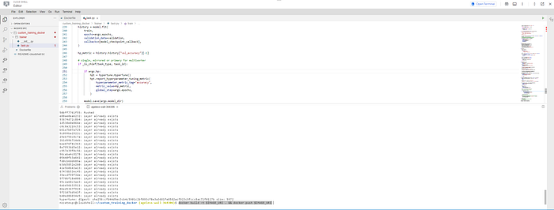

## Introduction

I believe that Google’s documentation is very hard to understand especially when it comes to Vertex AI. It took me days to create a hyperparameter-tuning job, get the best parameters, and train with these values. So, I’ve decided to write a medium post about it. It is a long journey and because of that, this will be a series of articles. The steps will be:

1. Setting the infrastructure
2. Uploading dataset
3. Hyperparameter-tuning
4. Training with the best parameters
5. Deploying the model to an endpoint and getting the predictions

The final result will look like this


This is part 2 of Tuning and Deploying HF Transformers with Vertex AI. In this article, we will create our training image.

In [part 1](/posts/tuning-and-deploying-hf-transformers-with-vertex-ai-part-1/), we created the necessary GCP components.

In [part 3](/posts/tuning-and-deploying-huggingface-transformers-with-vertex-ai/), we will start hyperparameter-tuning, train with the best parameters, and deploy the model to get predictions.

We will create a file structure like this:

```text
custom_training_docker/
├── trainer/
│   ├── __init__.py
│   └── task.py
└── Dockerfile
```

Now open the cloud shell and switch to editor mode to create these files.


Opening cloud shell



It is amazing, isn’t it?

task.py contains our training code and Dockerfile contains the necessary commands to dockerize our training code. Let’s start with task.py step by step. We will create our code considering [training code requirements by Google](https://cloud.google.com/vertex-ai/docs/training/code-requirements)

```python
import argpars
import os
parser = argparse.ArgumentParser()
parser.add_argument(
    "--model-dir",
    dest="model_dir",
    default=os.getenv("AIP_MODEL_DIR"),
    type=str,
    help="Model dir.",
)
parser.add_argument("--lr", dest="lr", default=0.001, type=float, help="Learning rate.")
parser.add_argument(
    "--epochs", dest="epochs", default=5, type=int, help="Number of epochs."
)
parser.add_argument(
    "--batch_size", dest="batch_size", default=16, type=int, help="Size of a batch."
)
parser.add_argument(
    "--distribute",
    dest="distribute",
    type=str,
    default="single",
    help="distributed training strategy",
)
parser.add_argument(
    "--project_name",
    dest="project",
    type=str,
    default=os.getenv("CLOUD_ML_PROJECT_ID"),
    help="name of the project",
)
parser.add_argument(
    "--bucket_name", dest="bucket", type=str, help="name of the project"
)
parser.add_argument(
    "--train_path", dest="train", type=str, help="GCS path of the train data"
)
parser.add_argument(
    "--test_path", dest="test", type=str, help="GCS path of the test data"
)
parser.add_argument(
    "--validation_path",
    dest="validation",
    type=str,
    help="GCS path of the validation data",
)
parser.add_argument("--hp", dest="hp", type=bool, help="Are we tuning hyperparameters?")
args = parser.parse_args()
```

**model_dir**: Where we should save our model? Vertex AI automatically gives you a GCS path in the AIP_MODEL_DIR environment variable but you can use this argument to change the default value. I don’t recommend it because when you start to train your model, Vertex AI will look to the AIP_MODEL_DIR path to get the model and save it to the model registry.

We will use **learning rate** and **epochs** as hyperparameters.

**distribute**: It is to say if we want to train our model with multiple workers or a single worker with 1 GPU/CPU or a single worker with multiple GPUs.

Lastly, the bucket name and paths are necessary to download data from Google Cloud Storage.

Now that we get our arguments, we can set our strategy, create the tokenizer, and train our model.

```python
import tensorflow as tf
from transformers import AutoTokenizer
# Single Machine, single compute device
if args.distribute == "single":
    if tf.test.is_gpu_available():
        strategy = tf.distribute.OneDeviceStrategy(device="/gpu:0")
    else:
        strategy = tf.distribute.OneDeviceStrategy(device="/cpu:0")
# Single Machine, multiple compute device
elif args.distribute == "mirrored":
    strategy = tf.distribute.MirroredStrategy()
# Multi Machine, multiple compute device
elif args.distribute == "multiworker":
    strategy = tf.distribute.MultiWorkerMirroredStrategy()
else:
    raise ValueError("Unknown distribution strategy")
tokenizer = AutoTokenizer.from_pretrained("google/electra-small-discriminator")
with strategy.scope():
    #  Model building/compiling need to be within
    # `strategy.scope()`.
    model = get_model()
train_data, validation_data = get_data()
train(model, train_data, validation_data)
```

Here the important part is we create our model inside the scope of the strategy. If we don’t do it like that, distributed training won’t work.

Now, we have 3 main methods to look at. These are get_model, get_data, and train.

### get_model()

```python
import keras
from keras import Model
from keras.layers import Dense
from keras.optimizers import Adam
from transformers import (
    TFAutoModel,
    TFPreTrainedModel,
)
from transformers.modeling_tf_outputs import TFBaseModelOutput
def get_model():
    input_ids = keras.Input(
        name="input_ids",
        shape=tokenizer.init_kwargs["model_max_length"],
        dtype="int32",
    )
    attention_mask = keras.Input(
        name="attention_mask",
        shape=tokenizer.init_kwargs["model_max_length"],
        dtype="int32",
    )
    base_model: TFPreTrainedModel = TFAutoModel.from_pretrained(
        "google/electra-small-discriminator"
    )
    base_model.trainable = False
    base_model_output: TFBaseModelOutput = base_model(
        {"input_ids": input_ids, "attention_mask": attention_mask}
    )
    last_hidden_state = base_model_output.last_hidden_state
    x = keras.layers.GlobalAveragePooling1D()(last_hidden_state)
    classification_layer = Dense(4, "softmax")(x)
    model = Model(inputs=[input_ids, attention_mask], outputs=[classification_layer])
    model.compile(
        optimizer=Adam(learning_rate=args.lr),
        loss="sparse_categorical_crossentropy",
        metrics=["accuracy"],
    )
    return model
```

> Yes, I know that I could create a TFAutoModelForSequenceClassification instead. But in this way, I can add more Dense layers after pooling.

As we need only 1 sentence for our task, we only need **“input_ids”** and **“attention_mask”** as the input. When we tokenize the data, we will use max length padding. Because of that, the shapes of the inputs are set to the model_max_length using the tokenizer.

Then we create our model as TFAutoModel, which outputs [batch_size, max_length, token_length]. After we made this base model not trainable, we get its output and get the average embedding value using average pooling. The second and maybe better approach would be using the first embedding output (CLS token’s output) but anyway.

Lastly, you can use as many as Dense layers you want but for simplicity, I choose to go only with the classification layer.

Now that we have our model, let's look at how we get the data.

### get_data()

```python
from google.cloud import storage
from google.cloud.storage import Bucket
from datasets import load_dataset
def hf_to_tf(dataset: datasets.Dataset, shuffle: bool) -> tf.data.Dataset:
    """Converts HuggingFace Dataset object into a TF Dataset.
    Args:
        dataset:  HuggingFace Dataset object
        shuffle:  Whether to shuffle the dataset
    Returns:
        TF Dataset object
    """
    data_collator = DataCollatorWithPadding(tokenizer=tokenizer, return_tensors="tf", padding=False)
    NUM_WORKERS = strategy.num_replicas_in_sync
    # Here the batch size scales up by number of workers since
    # `tf.data.Dataset.batch` expects the global batch size.
    GLOBAL_BATCH_SIZE = args.batch_size * NUM_WORKERS
    return dataset.to_tf_dataset(
        columns=["input_ids", "attention_mask"],
        label_cols=["labels"],
        batch_size=GLOBAL_BATCH_SIZE,
        collate_fn=data_collator,
        drop_remainder=True,
        shuffle=shuffle,
    )
def download_from_gcs():
    gcs_client = storage.Client(args.project)
    bucket: Bucket = gcs_client.bucket(args.bucket)
    train_blob = bucket.blob(args.train)
    test_blob = bucket.blob(args.test)
    validation_blob = bucket.blob(args.validation)
    train_blob.download_to_filename("train.csv")
    test_blob.download_to_filename("test.csv")
    validation_blob.download_to_filename("validation.csv")
def get_data():
    download_from_gcs()
    dataset = load_dataset(
        "csv",
        data_files={
            "train": "train.csv",
            "test": "test.csv",
            "validation": "validation.csv",
        },
    )
    dataset = dataset.map(lambda examples: {"labels": examples["label"]}, batched=True)
    dataset = dataset.map(
        function=lambda examples: tokenizer(
            examples["text"], truncation=True, padding="max_length"
        ),
        batched=True,
    )
    tf_train = hf_to_tf(dataset["train"], True)
    tf_val = hf_to_tf(dataset["validation"], False)
    tf_test = hf_to_tf(dataset["test"], False)
    if not args.hp:
        tf_train = tf_train.concatenate(tf_val)
        tf_val = tf_test
    return tf_train, tf_val
```

**download_from_gcs** basically downloads the data from GCS using the command-line arguments and saves it as “train/test/validation.csv”

**hf_to_tf** gets a huggingface dataset object and converts it to a TensorFlow dataset. Notice that we multiply the desired batch size by the number of workers. Because if we decided to go with a batch size of 16 and 4 workers. Tensorflow will distribute this batch to the 4 workers, basically, sending 4 examples to every worker. To prevent that, we need to multiply the batch size by the number of workers.

After we download the dataset, we can load the files into the huggingface dataset object to do some preprocessing. The first step is changing the column name “label” to “labels”. Why? Because HF wants it like that, don’t ask me! The second step is the standard tokenization and padding and truncation. Lastly, we convert these datasets into the TensorFlow dataset format.

If this is not a hyperparameter-tuning job, we can concatenate train and validation data because that means we already found the best parameters.

Now that we have our model and our dataset, we can start training!

### train()

```python
from keras import Model
import tensorflow as tf
import hypertune
import keras
def _is_chief(task_type, task_id):
    """Check for primary if multiworker training"""
    tf_config = json.loads(os.environ.get("TF_CONFIG", "{}"))
    cluster = tf_config["cluster"]
    if ("chief" in cluster) and "worker" in cluster:
        return task_type == "chief"
    return (
        (task_type == "chief")
        or (task_type == "worker" and task_id == 0)
        or task_type is None
    )
def train(model: keras.Model, train: tf.data.Dataset, validation: tf.data.Dataset):
    resolver = strategy.cluster_resolver
    task_type, task_id = resolver.task_type, resolver.task_id if resolver else (
        None,
        None,
    )
    base_callback_folder = os.getenv("AIP_CHECKPOINT_DIR")
    filepath = (
        "model-chef" if _is_chief(task_type, task_id) else f"workertemp_{task_id}"
    )
    model_checkpoint_callback = tf.keras.callbacks.ModelCheckpoint(
        filepath=f"{base_callback_folder}{filepath}",
        monitor="val_accuracy",
        mode="max",
        save_best_only=True,
    )
    history = model.fit(
        train,
        epochs=args.epochs,
        validation_data=validation,
        callbacks=[model_checkpoint_callback],
    )
    hp_metric = history.history["val_accuracy"][-1]
    # single, mirrored or primary for multiworker
    if _is_chief(task_type, task_id):
        if args.hp:
            hpt = hypertune.HyperTune()
            hpt.report_hyperparameter_tuning_metric(
                hyperparameter_metric_tag="accuracy",
                metric_value=hp_metric,
                global_step=args.epochs,
            )
        model.save(args.model_dir)
    # non-primary workers for multi-workers
    else:
        # each worker saves their model instance to a unique temp location
        model_save_dir = args.model_dir[:-1] + "workertemp_" + str(task_id)
        tf.io.gfile.makedirs(model_save_dir)
        model.save(model_save_dir)
```

**_is_chief** is responsible for detecting if the node/machine is a chief or a worker. In distributed training, we have 1 chief and 1 or more workers. Basically, they do the same thing but the chief has additional responsibilities such as checkpointing and saving the main model, tracking the whole training process, etc.

The training part is very straightforward. If the machine is a worker, it saves its checkpoints and saved models into a different folder. If it is chief, then it will save the model and checkpoint to the folder given by Vertex AI.

Note: Vertex AI gives us 3 important environment variables:

* `AIP_MODEL_DIR`: a Cloud Storage URI of a directory intended for [saving model artifacts](https://cloud.google.com/vertex-ai/docs/training/code-requirements#export).
* `AIP_CHECKPOINT_DIR`: a Cloud Storage URI of a directory intended for [saving checkpoints](https://cloud.google.com/vertex-ai/docs/training/code-requirements#resilience).
* `AIP_TENSORBOARD_LOG_DIR`: a Cloud Storage URI of a directory intended for saving [TensorBoard](https://www.tensorflow.org/tensorboard) logs. See [Using Vertex AI TensorBoard with custom training](https://cloud.google.com/vertex-ai/docs/experiments/tensorboard-training).

Finally, our code is ready! Let’s give a final look at the code.

```python
# Single, Mirrored and MultiWorker Distributed Training
import argparse
import json
import os
import datasets
import hypertune
import keras
import tensorflow as tf
from datasets import load_dataset
from google.cloud import storage
from google.cloud.storage import Bucket
from keras import Model
from keras.layers import Dense
from keras.optimizers import Adam
from transformers import (
    AutoTokenizer,
    DataCollatorWithPadding,
    TFAutoModel,
    TFPreTrainedModel,
)
from transformers.modeling_tf_outputs import TFBaseModelOutput
parser = argparse.ArgumentParser()
parser.add_argument(
    "--model-dir",
    dest="model_dir",
    default=os.getenv("AIP_MODEL_DIR"),
    type=str,
    help="Model dir.",
)
parser.add_argument("--lr", dest="lr", default=0.001, type=float, help="Learning rate.")
parser.add_argument(
    "--epochs", dest="epochs", default=5, type=int, help="Number of epochs."
)
parser.add_argument(
    "--batch_size", dest="batch_size", default=16, type=int, help="Size of a batch."
)
parser.add_argument(
    "--distribute",
    dest="distribute",
    type=str,
    default="single",
    help="distributed training strategy",
)
parser.add_argument(
    "--project_name",
    dest="project",
    type=str,
    default=os.getenv("CLOUD_ML_PROJECT_ID"),
    help="name of the project",
)
parser.add_argument(
    "--bucket_name", dest="bucket", type=str, help="name of the project"
)
parser.add_argument(
    "--train_path", dest="train", type=str, help="GCS path of the train data"
)
parser.add_argument(
    "--test_path", dest="test", type=str, help="GCS path of the test data"
)
parser.add_argument(
    "--validation_path",
    dest="validation",
    type=str,
    help="GCS path of the validation data",
)
parser.add_argument("--hp", dest="hp", type=bool, help="Are we tuning hyperparameters?")
args = parser.parse_args()
# Single Machine, single compute device
if args.distribute == "single":
    if tf.test.is_gpu_available():
        strategy = tf.distribute.OneDeviceStrategy(device="/gpu:0")
    else:
        strategy = tf.distribute.OneDeviceStrategy(device="/cpu:0")
# Single Machine, multiple compute device
elif args.distribute == "mirrored":
    strategy = tf.distribute.MirroredStrategy()
# Multi Machine, multiple compute device
elif args.distribute == "multiworker":
    strategy = tf.distribute.MultiWorkerMirroredStrategy()
else:
    raise ValueError("Unknown distribution strategy")
tokenizer = AutoTokenizer.from_pretrained("google/electra-small-discriminator")
def _is_chief(task_type, task_id):
    """Check for primary if multiworker training"""
    tf_config = json.loads(os.environ.get("TF_CONFIG", "{}"))
    cluster = tf_config["cluster"]
    if ("chief" in cluster) and "worker" in cluster:
        return task_type == "chief"
    return (
        (task_type == "chief")
        or (task_type == "worker" and task_id == 0)
        or task_type is None
    )
def hf_to_tf(dataset: datasets.Dataset, shuffle: bool) -> tf.data.Dataset:
    """Converts HuggingFace Dataset object into a TF Dataset.
    Args:
        dataset:  HuggingFace Dataset object
        shuffle:  Whether to shuffle the dataset
    Returns:
        TF Dataset object
    """
    data_collator = DataCollatorWithPadding(tokenizer=tokenizer, return_tensors="tf", padding=False)
    NUM_WORKERS = strategy.num_replicas_in_sync
    # Here the batch size scales up by number of workers since
    # `tf.data.Dataset.batch` expects the global batch size.
    GLOBAL_BATCH_SIZE = args.batch_size * NUM_WORKERS
    return dataset.to_tf_dataset(
        columns=["input_ids", "attention_mask"],
        label_cols=["labels"],
        batch_size=GLOBAL_BATCH_SIZE,
        collate_fn=data_collator,
        drop_remainder=True,
        shuffle=shuffle,
    )
def download_from_gcs():
    gcs_client = storage.Client(args.project)
    bucket: Bucket = gcs_client.bucket(args.bucket)
    train_blob = bucket.blob(args.train)
    test_blob = bucket.blob(args.test)
    validation_blob = bucket.blob(args.validation)
    train_blob.download_to_filename("train.csv")
    test_blob.download_to_filename("test.csv")
    validation_blob.download_to_filename("validation.csv")
def get_data():
    download_from_gcs()
    dataset = load_dataset(
        "csv",
        data_files={
            "train": "train.csv",
            "test": "test.csv",
            "validation": "validation.csv",
        },
    )
    dataset = dataset.map(lambda examples: {"labels": examples["label"]}, batched=True)
    dataset = dataset.map(
        function=lambda examples: tokenizer(
            examples["text"], truncation=True, padding="max_length"
        ),
        batched=True,
    )
    tf_train = hf_to_tf(dataset["train"], True)
    tf_val = hf_to_tf(dataset["validation"], False)
    tf_test = hf_to_tf(dataset["test"], False)
    if not args.hp:
        tf_train = tf_train.concatenate(tf_val)
        tf_val = tf_test
    return tf_train, tf_val
def get_model():
    input_ids = keras.Input(
        name="input_ids",
        shape=tokenizer.init_kwargs["model_max_length"],
        dtype="int32",
    )
    attention_mask = keras.Input(
        name="attention_mask",
        shape=tokenizer.init_kwargs["model_max_length"],
        dtype="int32",
    )
    base_model: TFPreTrainedModel = TFAutoModel.from_pretrained(
        "google/electra-small-discriminator"
    )
    base_model.trainable = False
    base_model_output: TFBaseModelOutput = base_model(
        {"input_ids": input_ids, "attention_mask": attention_mask}
    )
    last_hidden_state = base_model_output.last_hidden_state
    x = keras.layers.GlobalAveragePooling1D()(last_hidden_state)
    classification_layer = Dense(4, "softmax")(x)
    model = Model(inputs=[input_ids, attention_mask], outputs=[classification_layer])
    model.compile(
        optimizer=Adam(learning_rate=args.lr),
        loss="sparse_categorical_crossentropy",
        metrics=["accuracy"],
    )
    return model
def train(model: keras.Model, train: tf.data.Dataset, validation: tf.data.Dataset):
    resolver = strategy.cluster_resolver
    task_type, task_id = resolver.task_type, resolver.task_id if resolver else (
        None,
        None,
    )
    base_callback_folder = os.getenv("AIP_CHECKPOINT_DIR")
    filepath = (
        "model-chef" if _is_chief(task_type, task_id) else f"workertemp_{task_id}"
    )
    model_checkpoint_callback = tf.keras.callbacks.ModelCheckpoint(
        filepath=f"{base_callback_folder}{filepath}",
        monitor="val_accuracy",
        mode="max",
        save_best_only=True,
    )
    history = model.fit(
        train,
        epochs=args.epochs,
        validation_data=validation,
        callbacks=[model_checkpoint_callback],
    )
    hp_metric = history.history["val_accuracy"][-1]
    # single, mirrored or primary for multiworker
    if _is_chief(task_type, task_id):
        if args.hp:
            hpt = hypertune.HyperTune()
            hpt.report_hyperparameter_tuning_metric(
                hyperparameter_metric_tag="accuracy",
                metric_value=hp_metric,
                global_step=args.epochs,
            )
        model.save(args.model_dir)
    # non-primary workers for multi-workers
    else:
        # each worker saves their model instance to a unique temp location
        model_save_dir = args.model_dir[:-1] + "workertemp_" + str(task_id)
        tf.io.gfile.makedirs(model_save_dir)
        model.save(model_save_dir)
with strategy.scope():
    #  Model building/compiling need to be within
    # `strategy.scope()`.
    model = get_model()
train_data, validation_data = get_data()
train(model, train_data, validation_data)
```

Now we can create our Dockerfile.

```dockerfile
FROM gcr.io/deeplearning-platform-release/tf2-gpu.2-9
WORKDIR /
# Installs hypertune library
RUN pip install  transformers datasets google-cloud-storage cloudml-hypertune
# Copies the trainer code to the docker image.
COPY trainer /trainer
# Sets up the entry point to invoke the trainer.
ENTRYPOINT["python", "-m", "trainer.task"]
```

Let’s push it to the artifact registry! Open the terminal and run this command first:

```bash
gcloud auth configure-docker europe-west4-docker.pkg.dev
```

This will give us the ability to use docker push in our artifact registry docker repository. Then set the IMAGE_URI variable in this format:

```bash
IMAGE_URI=europe-west4-docker.pkg.dev/{project_name}/{repository_name}/tweet_eval:hypertune
```

Then cd into the custom_training_docker folder and run these commands:

```bash
docker build -t $IMAGE_URI . && docker push $IMAGE_URI
```

And we are done! In the next part, we will start the hyperparameter-tuning job, and using the best values, we will create a training job to create a model and deploy it into an endpoint.

Thanks a lot for reading!

## Resources

1. [https://cloud.google.com/vertex-ai/docs/training/code-requirements](https://cloud.google.com/vertex-ai/docs/training/code-requirements)
2. [https://codelabs.developers.google.com/vertex_multiworker_training](https://codelabs.developers.google.com/vertex_multiworker_training)
3. [https://cloud.google.com/artifact-registry/docs/docker/pushing-and-pulling#auth](https://cloud.google.com/artifact-registry/docs/docker/pushing-and-pulling#auth)
