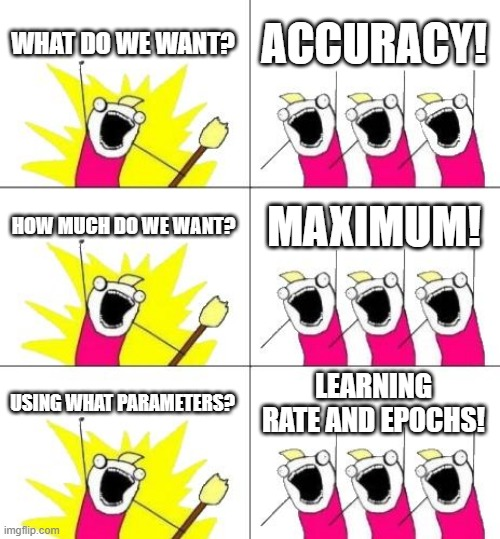

## Introduction

I believe that Google’s documentation is very hard to understand especially when it comes to Vertex AI. It took me days to create a hyperparameter-tuning job, get the best parameters, and train with these values. So, I’ve decided to write a medium post about it. It is a long journey and because of that, this will be a series of articles. The steps will be:

1. Setting the infrastructure
2. Uploading dataset
3. Hyperparameter-tuning
4. Training with the best parameters
5. Deploying the model to an endpoint and getting the predictions

The final result will look like this


This is part 3 of Tuning and Deploying HF Transformers with Vertex AI.

In [part 1](/posts/tuning-and-deploying-hf-transformers-with-vertex-ai-part-1/), we created the necessary GCP components.

In [part 2](/posts/tuning-and-deploying-hf-transformers-with-vertex-ai-part-2/), we created model training and tuning code and wrap it into a docker container.

For looking at the whole code we will use check this [GitHub repository](https://github.com/NusretOzates/huggingface-gcp-classification).

Open your Jupyter Lab environment from Vertex AI or you can use Shell Editor and create a file `training.py`. You can change the name of course.

```python
import os
from datetime import datetime
import numpy as np
from google.cloud import aiplatform
from google.cloud.aiplatform import hyperparameter_tuning as hpt
from google.cloud.aiplatform.models import Prediction
from transformers import AutoTokenizer
PROJECT_NAME = ""
BUCKET_NAME = ""
REPOSITORY_NAME = ""
LOCATION = ""
# I'm assuming the reader created a docker artifact at the artifact registry with a name 'vertex-ai-images'
IMAGE_URI = (
    f"{LOCATION}-docker.pkg.dev/{PROJECT_NAME}/{REPOSITORY_NAME}/tweet_eval:hypertune"
)
# For having unique names for the training jobs
TIMESTAMP = datetime.now().strftime("%Y%m%d%H%M%S")
aiplatform.init(project=PROJECT_NAME, location=LOCATION, staging_bucket=BUCKET_NAME)
```

We begin with imports and some constants to initialize the AI Platform.

**PROJECT_NAME**: Your project name
**BUCKET_NAME**: Your Google Cloud Storage bucket name to save training metadata or saving models
**REPOSITORY_NAME**: Your Google Cloud Artifact Registry Docker Repository name
**LOCATION**: Where should training and tuning begin? If you followed the previous parts, this should be `europe-west4`. As all parts of the training will be in the same region, everything will be faster with reduced latency.
**IMAGE_URI**: URI of the training docker image to use
**TIMESTAMP**: We will use this when giving job names to train and tune models

To create `HyperparameterTuningJob`, we need to create a `CustomJob` first.

CustomJob object needs 3 parameters: `display_name`, `project_name`, and `worker_pool_specs`. The first two are very simple to set. The last is still simple but it is longer.

```python
container_spec = {
    "image_uri": IMAGE_URI,
    "args": [
        f"--project_name={PROJECT_NAME}",
        f"--bucket_name={BUCKET_NAME}",
        f"--train_path=tweet_eval_emotions/data/train/train.csv",
        f"--test_path=tweet_eval_emotions/data/test/test.csv",
        f"--validation_path=tweet_eval_emotions/data/validation/validation.csv",
        f"--distribute=multiworker",
        f"--batch_size=32",
        f"--hp=True",
    ],
}
machine_spec = {
    "machine_type": "n1-standard-4",
    # "accelerator_type": "NVIDIA_TESLA_T4",
    # "accelerator_count": 2,
}
worker_pool_specs = [
    {
        "machine_spec": machine_spec,
        "replica_count": 1,
        "container_spec": container_spec,
    },
    {
        "machine_spec": machine_spec,
        "replica_count": 2,
        "container_spec": container_spec,
    },
]
JOB_NAME = "custom_nlp_training-hyperparameter-job " + TIMESTAMP
custom_job = aiplatform.CustomJob(
    display_name=JOB_NAME, project=PROJECT_NAME, worker_pool_specs=worker_pool_specs
)
```

Every worker pool needs to set three parameters. `machine_spec`, `container_spec`, and `replica_count`.

### machine_spec

Which machine do you want to use for the workers in your worker pool? Do you want to use GPU in your workers and which one and how many? For choosing a suitable machine type and GPU type refer [here](https://cloud.google.com/vertex-ai/docs/predictions/configure-compute).

I’m broke and using the free trial of GCP. So I choose a basic machine without GPU :)

### container_spec

Which container do you want to use for your workers? And which command line arguments do you want to add to your container? We completed our dockerfile using `ENTRYPOINT` , remember? Now you can see that the reason is we want to “append” these arguments into the container.

### worker_pool_specs

Pay attention that this is not a dictionary, it is a list of dictionaries! It could have at most 4 elements and every element has a different responsibility. Directly from the source:

> Worker pool 0 configures the Primary, chief, scheduler, or “master”. In `MultiWorkerMirroredStrategy`, all machines are designated as workers, which are the physical machines on which the replicated computation is executed. In addition to each machine being a worker, there needs to be one worker that takes on some extra work such as saving checkpoints and writing summary files to TensorBoard. This machine is known as the chief. There is only ever one chief worker, so your worker count for worker pool 0 will always be 1.

> You can choose to add GPUs, but keep in mind that for `MultiWorkerMirroredStrategy` each machine in your cluster should have the same number of GPUs. Adding GPUs will also increase the cost of the training job.

And worker pool 1 is where you configure the workers for your cluster.

Worker pool 2 is for `ParameterServerStrategy` and if you want to add an evaluator, you would add worker pool 3.

Now that we set worker pools 0 and 1, we have configured to have three CPU-only machines. When the training application code is run, `MultiWorkerMirroredStrategy` will distribute the training across both machines.

### HyperparameterTuningJob

Now we came to the easy part!

```python
metric_spec = {"accuracy": "maximize"}
parameter_spec = {
    "lr": hpt.DoubleParameterSpec(min=0.001, max=1, scale="log"),
    "epochs": hpt.IntegerParameterSpec(min=1, max=3, scale="linear"),
}
hp_job = aiplatform.HyperparameterTuningJob(
    display_name=JOB_NAME,
    custom_job=custom_job,
    metric_spec=metric_spec,
    parameter_spec=parameter_spec,
    max_trial_count=2,
    parallel_trial_count=2,
    project=PROJECT_NAME,
)
hp_job.run()
metrics = [trial.final_measurement.metrics[0].value for trial in hp_job.trials]
best_trial = hp_job.trials[metrics.index(max(metrics))]
best_accuracy = float(best_trial.final_measurement.metrics[0].value)
best_values = {param.parameter_id: param.value for param in best_trial.parameters}
```



I think this meme is enough to tell what we did here! :) I want to add one explanation about `scale` parameters.

Linear scale: Typically, you choose this if the range of all values from the lowest to the highest is relatively small (within one order of magnitude), because uniformly searching values from the range will give you a reasonable exploration of the entire range.

Log scale: Logarithmic scaling works only for ranges that have only values greater than 0.

Choose logarithmic scaling when you are searching a range that spans several orders of magnitude. For example, if you are tuning a model, and you specify a range of values between .0001 and 1.0 for the `learning_rate` hyperparameter, searching uniformly on a logarithmic scale gives you a better sample of the entire range than searching on a linear scale would, because searching on a linear scale would, on average, devote 90 percent of your training budget to only the values between .1 and 1.0, leaving only 10 percent of your training budget for the values between .0001 and .1.

Reverse log scale: Reverse logarithmic scaling is supported only for continuous hyperparameter ranges. It is not supported for integer hyperparameter ranges.

Reverse logarithmic scaling works only for ranges that are entirely within the range 0<=x<1.0.

Choose reverse logarithmic scaling when you are searching a range that is highly sensitive to small changes that are very close to 1.

To learn more details about scales you can look [here](https://towardsdatascience.com/why-is-the-log-uniform-distribution-useful-for-hyperparameter-tuning-63c8d331698), [here](https://stats.stackexchange.com/questions/467372/scale-selection-for-the-hyperparameters), and lastly [here](https://www.youtube.com/watch?v=sBhEi4L91Sg&ab_channel=KhanAcademy).

**max_trial_count**: How many different values should I try?

**parallel_trial_count**: How many trials should I try at once? The important point here is you need to make this number small such as 3. Because Vertex AI uses [Bayesian optimization](https://towardsdatascience.com/a-conceptual-explanation-of-bayesian-model-based-hyperparameter-optimization-for-machine-learning-b8172278050f) which uses previous trials to choose the best hyperparameters to try next.

The run function will block the execution and wait until tuning is done and trust me it will take such a long time. Go make a coffee, maybe it is a nice day for working out?

Now that we get the best parameters from the`HyperparameterTuningJob` we can start training. We will use train + validation data this time.

```python
MACHINE_TYPE = "n1-standard"
VCPU = "4"
TRAIN_COMPUTE = MACHINE_TYPE + "-" + VCPU
print("Train machine type", TRAIN_COMPUTE)
# The difference is not only /training /prediction. train image's name starts with tf, deploy image starts with tf2
DEPLOY_IMAGE = "europe-docker.pkg.dev/vertex-ai/prediction/tf2-cpu.2-9:latest"
print("Deployment:", DEPLOY_IMAGE)
container_job = aiplatform.CustomContainerTrainingJob(
    display_name=f"custom_nlp_training_{TIMESTAMP}",
    container_uri=IMAGE_URI,
    model_serving_container_image_uri=DEPLOY_IMAGE,
    project=PROJECT_NAME,
)
container_spec["args"].pop()
container_spec["args"].append(f"--hp=False")
container_spec["args"].append(f"--lr={best_values['lr']}")
container_spec["args"].append(f"--epochs={int(best_values['epochs'])}")
model = container_job.run(
    model_display_name=f"tweet_eval_{TIMESTAMP}",
    args=container_spec["args"],
    replica_count=3,
    machine_type=TRAIN_COMPUTE,
    sync=True,
)
```

First, we’ve created a `CustomContainerTrainingJob` which allows us to create training jobs using containers. We give our training image to `container_uri` and set a deployment image prepared by Vertex AI itself. There are faster images to deploy your model that created by Vertex AI but it is a topic for another article.

Before running the job, we set the “hp” parameter to False and add the best hyperparameters to model arguments. We set 3 as the replica count and the job itself will automatically create 1 chef and 2 workers for us.

> replica_count (int):
>  The number of worker replicas. If replica count = 1 then one chief
>  replica will be provisioned. If replica_count > 1 the remainder will be
>  provisioned as a worker replica pool.

After the training is done, we will get an `Model` object that we can use to get information about the model, start batch prediction or deploy to an endpoint. Now it is time to deploy our model and get predictions.

```python
VCPU = "4"
DEPLOY_COMPUTE = MACHINE_TYPE + "-" + VCPU
print("Deploy machine type", DEPLOY_COMPUTE)
# Create an endpoint
endpoint = model.deploy(machine_type=DEPLOY_COMPUTE, sync=True)
tokenizer = AutoTokenizer.from_pretrained("google/electra-small-discriminator")
example_text = tokenizer("I love you", truncation=True, padding="max_length")
example_text.pop("token_type_ids")
# Get prediction from the endpoint
prediction: Prediction = endpoint.predict(instances=[example_text])
print(prediction.predictions[0])
index = np.argmax(prediction.predictions[0])
id_to_label = {0: "anger", 1: "joy", 2: "optimism", 3: "sadness"}
print(id_to_label[index])
```

It is pretty easy, right? We basically choose a machine type and call `deploy()` which gives us an Endpoint object. Then, we load the tokenizer from our training code, tokenize a text and get a prediction by wrapping it into a list and giving it as a parameter to `predict()`.

And that’s it! After 3 parts we managed to tune, train and serve a Huggingface Transformers model! The next step should be separating all the components into functions and deploying them as a Kubeflow pipeline.

I hope you enjoy reading this article series!

## Resources

1. [https://cloud.google.com/vertex-ai/docs/predictions/configure-compute](https://cloud.google.com/vertex-ai/docs/predictions/configure-compute)
2. [https://codelabs.developers.google.com/vertex_multiworker_training#5](https://codelabs.developers.google.com/vertex_multiworker_training#5)
3. [https://towardsdatascience.com/why-is-the-log-uniform-distribution-useful-for-hyperparameter-tuning-63c8d331698](https://towardsdatascience.com/why-is-the-log-uniform-distribution-useful-for-hyperparameter-tuning-63c8d331698)
4. [https://stats.stackexchange.com/questions/467372/scale-selection-for-the-hyperparameters](https://stats.stackexchange.com/questions/467372/scale-selection-for-the-hyperparameters)
5. [https://www.youtube.com/watch?v=sBhEi4L91Sg&ab_channel=KhanAcademy](https://www.youtube.com/watch?v=sBhEi4L91Sg&ab_channel=KhanAcademy)
6. [https://towardsdatascience.com/a-conceptual-explanation-of-bayesian-model-based-hyperparameter-optimization-for-machine-learning-b8172278050f](https://towardsdatascience.com/a-conceptual-explanation-of-bayesian-model-based-hyperparameter-optimization-for-machine-learning-b8172278050f)
