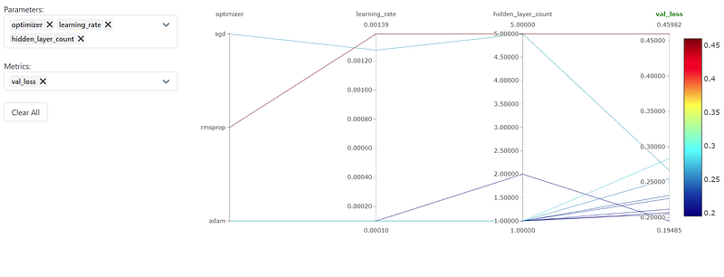

Photo by [Resource Database™](https://unsplash.com/@resourcedatabase?utm_source=medium&utm_medium=referral) on [Unsplash](https://unsplash.com?utm_source=medium&utm_medium=referral)

Hello, everyone! Today I needed to use Keras Tuner for my task and I wanted to track the hyperparameters with MLFlow. But I couldn’t find any good resources on the Internet. So, I figured it out myself and decided to share it with everyone. Let’s get started!

It’s actually pretty straightforward and I will directly give the answer. The solution is subclassing the HyperModel class. First, do your imports and set the experiment name:

```python
import pandas as pd
from numpy.random import default_rng
from model import SGNN
from keras_tuner import HyperParameters, BayesianOptimization
import tensorflow as tf
import mlflow
import keras_tuner
mlflow.set_tracking_uri("http://localhost:5000")
mlflow.set_experiment("My Experiment Name")
```

Second subclass the HyperModel class:

```python
# Create a HyperModel subclass
class SGNNHyperModel(keras_tuner.HyperModel):
    def build(self, hp):
        # Create your model, set some hyper-parameters here
        model = SomeModel()
        return model
    def fit(self, hp, model, *args, **kwargs):
        with mlflow.start_run():
            mlflow.log_params(hp.values)
            mlflow.tensorflow.autolog()
            return model.fit(*args, **kwargs)
```

Normally, we create a function that takes the HyperParameters object and returns a model. This function is the***build***method in our new class. In the fit method, we have the model, hyper-parameters, and args to give the standard fit method of Keras. Using/Inside MLflow’s start_run function, we can log our parameters. With the “autolog”, other parameters and model artifacts will be stored too! Now all you need to do is start searching:

```python
tuner = BayesianOptimization(
    SGNNHyperModel(),
    max_trials=20,
    # Do not resume the previous search in the same directory.
    overwrite=True,
    objective="val_loss",
    # Set a directory to store the intermediate results.
    directory="/tmp/tb",
)
train, test = load_dataset()
tuner.search(train, epochs=5, validation_data=test)
best_model = tuner.get_best_models()[0]
best_hyperparameters= tuner.get_best_hyperparameters()[0].values
```

And that’s it! You can see your models in the MLflows UI and compare them however you want!



I hope this will help, thanks for reading!
