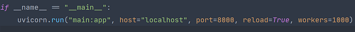

Let's say you have an AI task to solve. You get the data, clean the data, trained a model with it, and find the best hyperparameters. After these steps, you need to deploy your model or it won't be useful, right? Once you have developed and trained a model that you're happy with, it's now time to deploy it. You can deploy your model with 3 options:

1. Using Tensorflow Serving in your server
2. Using Tensorflow Lite to embed your model to mobile apps or in IoT components.
3. Using Tensorflow JS you can use your model right in the user's browser.

In this article, I will focus on Tensorflow Serving.

## Tensorflow Serving

According to the TFX guide, TensorFlow Serving (TFS) is a flexible, high-performance serving system for machine learning models, designed for production environments. It consumes a SavedModel and will accept inference requests over either REST or gRPC interfaces. It runs as a set of processes on one or more network servers, using one of several advanced architectures to handle synchronization and distributed computation.

What are the benefits? Why should I use Tensorflow Serving instead of calling my model inside FastAPI(as an example, because it is fast.)?

Because TensorFlow Serving is specially designed and optimized for "Serving" your model, it is a lot faster than using in any python based backend-framework. In the end, I will share some test results to answer this question crystal clear.

While we are using GPU for training and predicting, we have some trouble when we try to use our model in a backend framework. Let's say you have some requests from 20 different users. To handle more requests from more unique users, what would you do is incrementing worker counts like this:



But as you run your service you will get an error after you get a request from more than 1 user at the same time. The issue is GPU synchronization. When you separate your service and your model with Tensorflow Serving, you can increment your worker count as much as you want and Tensorflow Serving will handle everything for you, the speed enhancement is very big and a nice bonus.

Now it's time to share some impressive results of Tensorflow Serving. I've tested a model with a pre-trained BERT-base for the transfer learning part. I've used Locust to test the RPS rate and median response time. I have RTX 2060 GPU and Ryzen 5 1600AF CPU. In the tables below, RPS = Request per second and MRT = Median Response Time.

### TF Serving using CPU (Worker count = User count)

```
+-----------------------+-------+---------+
|        Test           | RPS   | MRT(ms) |
+-----------------------+-------+---------+
| 1 User 5000 request   |     9 |     100 |
| 10 User 5000 request  |  15.5 |     620 |
| 50 User 5000 request  |    18 |    2900 |
+-----------------------+-------+---------+
```

I don't know the reason but you don't have any problem with worker count if you use CPU to run your model.

### Model in FastAPI using CPU (Worker count = User count)

```
+-----------------------+------------+------------+
|        Test           |    RPS     |  MRT(ms)   |
+-----------------------+------------+------------+
| 1 User 5000 request   | 7.1        | 100        |
| 10 User 5000 request  | 16         | 620        |
| 50 User 5000 request  | PC crashed | PC crashed |
+-----------------------+------------+------------+
```

### Tensorflow Serving using GPU (Worker count = User count)

```
+-----------------------+------+---------+
|        Test           | RPS  | MRT(ms) |
+-----------------------+------+---------+
| 1 User 5000 request   |   45 |      21 |
| 10 User 5000 request  |  105 |      87 |
| 50 User 5000 request  |  120 |     330 |
+-----------------------+------+---------+
```

Reminder for next table, worker count must be 1, otherwise you will get an error!

### Model in FastAPI using GPU (Worker count = 1)

```
+-----------------------+-------+---------+
|        Test           | RPS   | MRT(ms) |
+-----------------------+-------+---------+
| 1 User 5000 request   | 20.7  |      45 |
| 10 User 5000 request  | 22    |     450 |
| 50 User 5000 request  | 22-24 |    2300 |
+-----------------------+-------+---------+
```

## References

1. [https://www.tensorflow.org/tfx/guide](https://www.tensorflow.org/tfx/guide)
2. [https://www.tensorflow.org/tfx](https://www.tensorflow.org/tfx)
