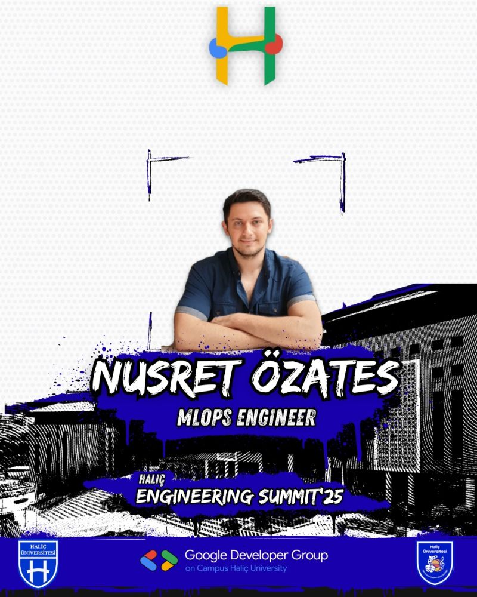
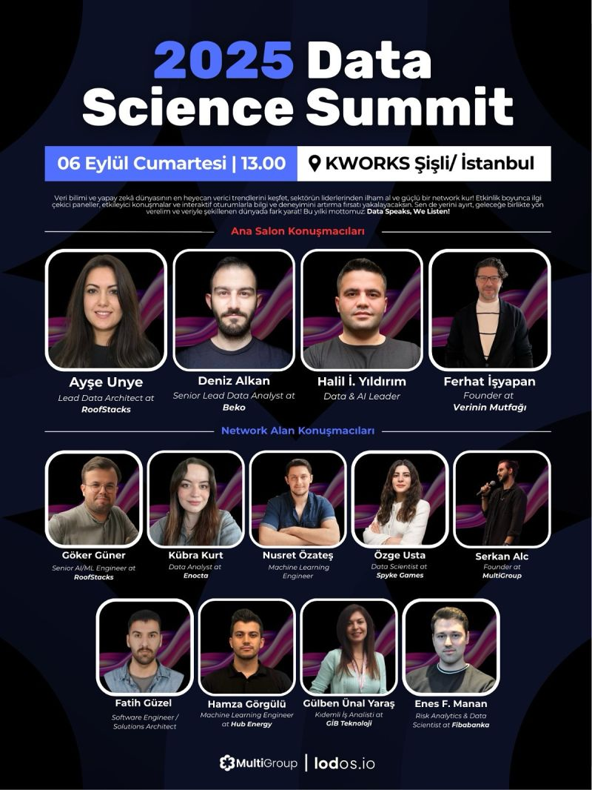
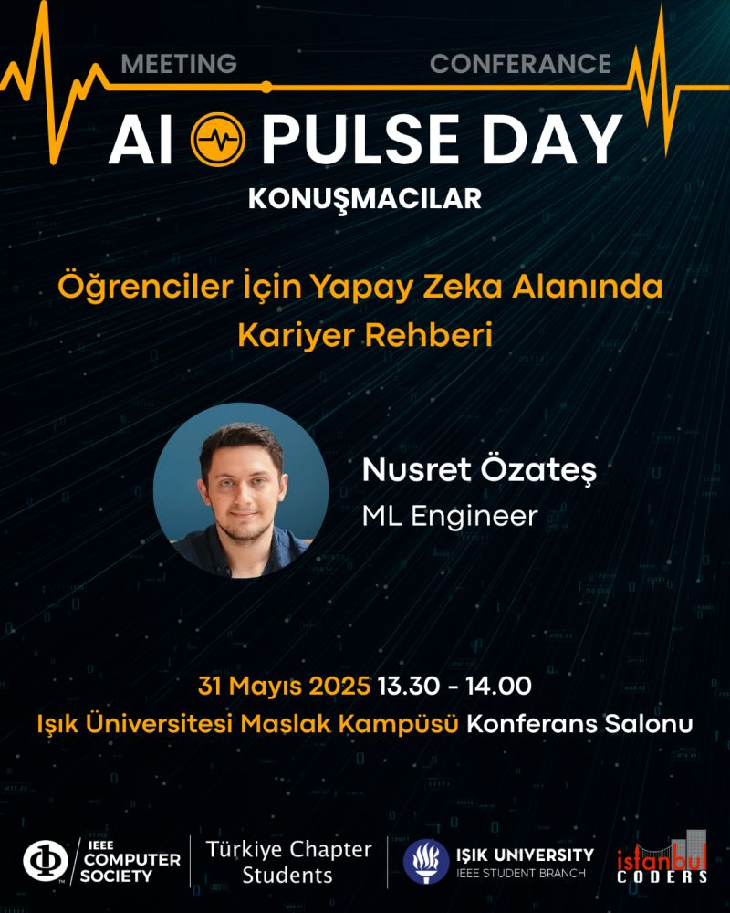
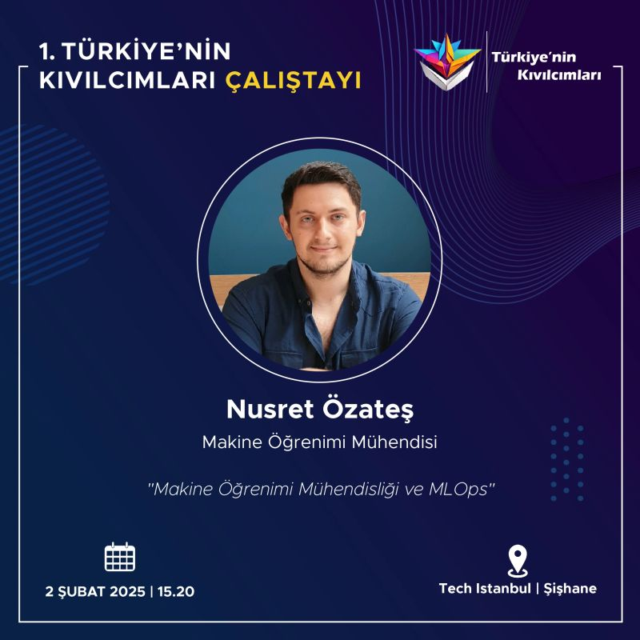

## About Me

As a **Machine Learning Engineer**, I build and refine end-to-end ML systems, handling tasks from data collection to model deployment on cloud platforms, with a focus on practical, scalable solutions. 

I have 4 years of experience in **Natural Language Processing**, and even surprisingly to me, I am working on **Graph Neural Networks**, **Vision Transformers**, and WSI Images for 3 years! I can even detect cancerous cells in pancreatic histology images by my eyes now...

I am also skilled in **MLOps**, using tools such as Kubeflow, FastAPI, and Transformers to automate and optimise the ML lifecycle. Previously, I worked as an MLOps Engineer and a Senior Machine Learning Engineer at GLOSA and Carbon Consulting, respectively, where I implemented an AutoNLP platform and led the development team of the AI department.

## Education & Certifications

🎓 **Master of Science in Computer Science** — Koç University

📜 **Google Cloud Certified Professional Machine Learning Engineer**

📜 **Certified Spark NLP Data Scientist**

## Publications

<!-- PUBLICATION TEMPLATE - Copy the block below for each new publication -->
<!-- 
::: {.pub-card}
[Your Paper Title Here]{.pub-title}

[**Your Name**, Co-Author 1, Co-Author 2]{.pub-authors}

[Conference/Journal Name, Year]{.pub-venue}

::: {.pub-links}
[PDF](link-to-pdf) [Code](link-to-code) [DOI](link-to-doi)
:::
:::
-->

::: {.pub-card}
[Systematic comparison of GPT models for the analysis of pathology reports in a low-resource language: A case study for Turkish]{.pub-title}

[Omer Faruk Dilbaz, **Muhammet Nusret Ozates**, Beyza Bolat, Cigdem Gunduz-Demir, Ibrahim Kulac]{.pub-authors}

[American Journal of Clinical Pathology, Volume 164, Issue 5, November 2025]{.pub-venue}

::: {.pub-links}
[DOI](https://doi.org/10.1093/ajcp/aqaf091)
:::
:::

::: {.pub-card}
[BLM-17m: A Large-Scale Dataset for Black Lives Matter Topic Detection on Twitter]{.pub-title}

[H. Kemik, **N. Özateş**, M. Asgari-Chenaghlou, Y. Li, E. Cambria]{.pub-authors}

[IEEE International Conference on Data Mining Workshops (ICDMW), Shanghai, China, 2023]{.pub-venue}

::: {.pub-links}
[DOI](https://doi.org/10.1109/ICDMW60847.2023.00100)
:::
:::

## Talks & Features

<!-- TALK TEMPLATE - Copy the block below for each new talk/feature -->
<!--
::: {.talk-card}
{.talk-image}

::: {.talk-content}
### Talk Title Here

📍 Haliç Engineering Summit | 📅 8 December 2025

We talked about engineering, acedemy, job opportunities and more!

::: {.talk-links}
[LinkedIn Post](linkedin-url) [Slides](slides-url) [Video](video-url)
:::
:::
:::
-->

::: {.talk-card}
{.talk-image}

::: {.talk-content}
### Haliç Engineering Summit

📍 Haliç University | 📅 8 December 2025

We talked about engineering, academy, job opportunities and more!

::: {.talk-links}
[LinkedIn Post](https://www.linkedin.com/feed/update/urn:li:activity:7402271975710113792/)
:::
:::
:::

<!-- Talk 2  -->

::: {.talk-card}
{.talk-image}

::: {.talk-content}
### Data Science Summit

📍 KWORKS Şişli | 📅 6 September 2025

I was there as "network field speaker" to chat with everyone about AI.

::: {.talk-links}
[LinkedIn Post](https://www.linkedin.com/feed/update/urn:li:activity:7368703418615447553/)
:::
:::
:::

<!-- Talk 3  -->

::: {.talk-card}
{.talk-image}

::: {.talk-content}
### AI Pulse Day

📍 Işık University | 📅 31 May 2025

Career guide in AI for university students.

::: {.talk-links}
[LinkedIn Post](https://www.linkedin.com/feed/update/urn:li:activity:7331227895991816193/)
:::
:::
:::

<!-- Talk 4  -->

::: {.talk-card}
{.talk-image}

::: {.talk-content}
### Türkiye'nin Kıvılcımları Workshop

📍 Tech Istanbul | 📅 2 February 2025

ML Engineering and MLOps

::: {.talk-links}
[LinkedIn Post](https://www.linkedin.com/feed/update/urn:li:activity:7331227895991816193/)
:::
:::
:::

