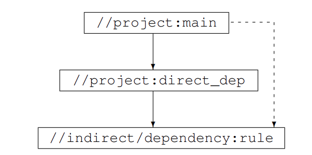

Photo by [AbsolutVision](https://unsplash.com/es/@freegraphictoday?utm_source=medium&utm_medium=referral) on [Unsplash](https://unsplash.com/?utm_source=medium&utm_medium=referral)

## Introduction

Google is one of the world’s most successful companies, and its success is based in part on how well it utilizes its resources. In this article review, we will be looking at the “Searching for Build Debt: Experiences Managing Technical Debt at Google” article, in which the authors provide an in-depth analysis of the experiences, practices, and lessons learned from their research on managing technical debt (more specifically BUILD debt) at Google. We will discuss the article’s findings and implications, as well as its implications for other organizations.

## What is Technical Debt?

Technical debt is the cost associated with taking shortcuts when developing software. This debt can be accumulated when developers are in a rush to meet deadlines, or when they make decisions to save time in the short term that may cause long-term problems. The authors state that technical debt is “a pervasive challenge across organizations,” and it is a “necessary evil” in the software development process.

## What is Build Debt?

The specifications for building software at Google are encapsulated in BUILD files. BUILD files define modules of code (either at the library or binary level), list the source files and dependent libraries the module uses, and include additional metadata about building the project. They are manually maintained which means over time, these files can diverge from the actual dependencies to build, test, and execute the software. These build files can cause some other problems which we will discuss further.

## Google’s Approach to “Build Debt”

1.   Automation. The fix must be automated whenever it is possible
2.   Make it easy to do the right thing. Analyze the changes during editing, browsing, or code review to prevent certain kinds of debt
3.   Make it hard to do the wrong thing. Ex. Prevent people from taking a dependency that is not ready for use by others. Build stricter checks into compile process and make them compile time error

The team doesn’t own any software or library at Google. So their solutions are domain independent.

## Dependency Debt

We have 3 main keywords here:

1.   Over-declared dependencies. These are the dependencies you don’t need or use.
2.   Under-utilized dependencies. These are the ones you used very little.
3.   Under-declared dependencies. You are using these dependencies using another dependency.

Let’s look at the third one a little bit more. So, your project’s name is A which depends on B and B depends on C. You are using a class from C, but you import it from project B.

One day, project B will depend on project C and your project will not build! This makes your project more brittle.

Target dependencies

## Addressing Dependency Debt

At first, we need to start finding under-declared dependencies and add those as direct dependencies. In the article, the authors found these dependencies using the javac compiler by getting classpaths of loaded classes.

Second, we will find unused dependencies which are easier after the first step.

## Clipper

Clipper is a dependency refactoring assistant. It looks at the dependency graph and suggests specific dependencies that would be good cleanup candidates. It uses a ranking algorithm to decide which dependency is easier than others. The factors are:

1.   The number of symbols defined by the target: The more symbols (e.g., variables, functions, classes) that are defined within the target system or codebase, the more work may be required to refactor it.
2.   The cumulative number of symbols in the transitive closure of the target’s dependencies: This refers to the number of symbols defined by the target’s dependencies, as well as the dependencies of those dependencies, and so on. The more symbols there are in the transitive closure, the more complex the refactoring effort may be.
3.   The utilization of symbols: If the symbols defined by the target and its dependencies are heavily used within the codebase, it may be more difficult to refactor them without breaking the system.
4.   Dependency proximity or depth: This refers to the number of “hops” or intermediary dependencies between the target and its dependencies. The more hops there are, the more complex the refactoring effort may be.
5.   Dependency interconnectedness or density: This refers to the total number of paths that lead to a dependency. If there are many paths leading to a dependency, it may be more difficult to refactor the dependency without affecting the rest of the system.

## Zombie Targets

Some projects in Google’s code can be abandoned and become forgotten. But even these projects are visible to everyone to use. And when these projects are used by active projects, most of the time engineers had to fix bugs in an unmaintained project. To find these zombie targets, Google uses a system that looks for:

1.   When was the last time this target was built successfully
2.   When was the last time someone attempted to build this target

If a target failed to build for at least 90 days, it will be declared dead and removed from the codebase.

## Visibility Debt

When you can view all other projects and use them as a dependency, you can depend on a project that is not ready for sharing or not intended to be shared with other people. If a project depends on your project, you won’t know until you break something on their side. To fix this, the team decided to make all new projects’ default visibility private and all old projects’ visibility “legacy public”. If a team wants to use another team’s code, they need to talk and agree on whether the API is ready to share and under what conditions.

This caused a lot of drama within Google! “This is un-Googley,” they said. “It will lead to lots of code duplication,” they said. “It will cause widespread build breakages,” they said. But none of this happened, and they changed the visibility system with minimal drama.

**Funny fact: Nearly half of the new files start out publicly visible despite the new default, a reminder of Googler’s attitude toward openness.**

> _Lesson learned: any change will always be opposed by someone and in a large organization it is important to have an independent group that is empowered to make decisions based on a global cost-benefit analysis._
> 
> 
> _— The authors_

## Dead Flags

You know, the options you use when you’re using a CLI app from terminals? When you want to make your library more customizable, test something, or experiment, you add some flags. This causes dead code to be added to the library, and these options guard it. Some flags can be removed, and some can be replaced with a constant. The authors organized a Fixit day, and engineers removed 2300 flags from the codebase. As a result, 272,000 lines of code were removed too!

## Conclusion

Build debt reduces engineer productivity with slower builds, more fragile projects, and upkeep of broken libraries. It also increases the cost of building, running, and testing projects.

The article’s final recommendations are:

1.   Since many engineers oppose addressing technical debt because it could slow them down or lead to code duplication, prioritizing and managing it can’t always be left to individual teams.
2.   As codebase size increases, the cost of recovering from technical debt rises non-linearly. Thus, it’s essential to pay attention to these debts early and invest in tools, policies, and processes that make an organization aware of the debt and make it easy to continually repay/avoid it as part of each engineer’s regular workflow.

## Reference

Original article: [https://research.google/pubs/pub37755/](https://research.google/pubs/pub37755/)
