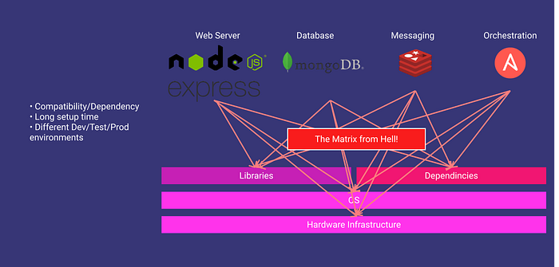
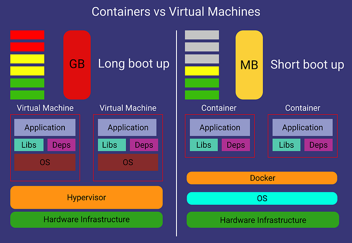
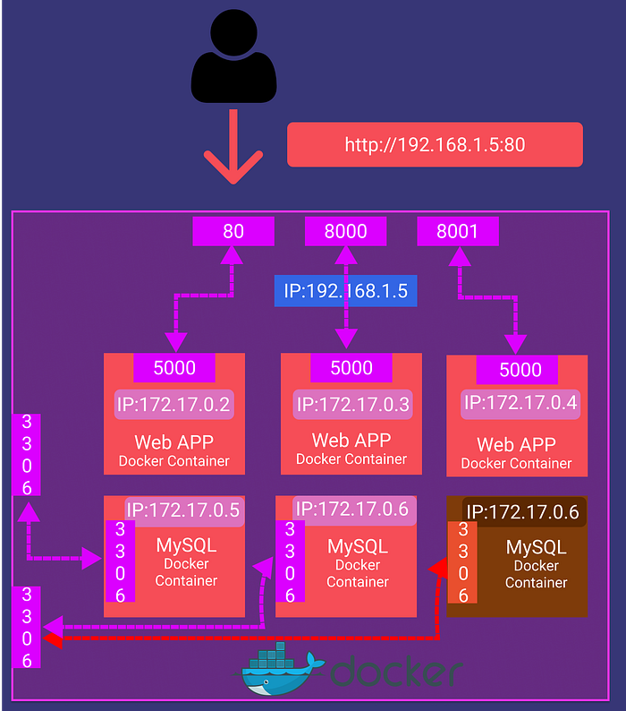
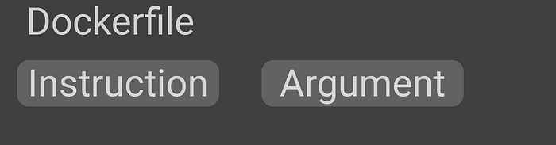
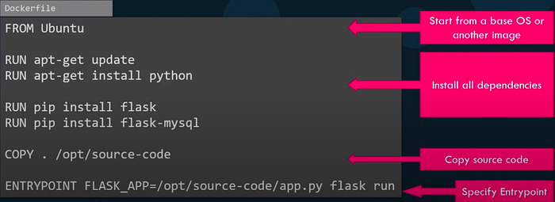
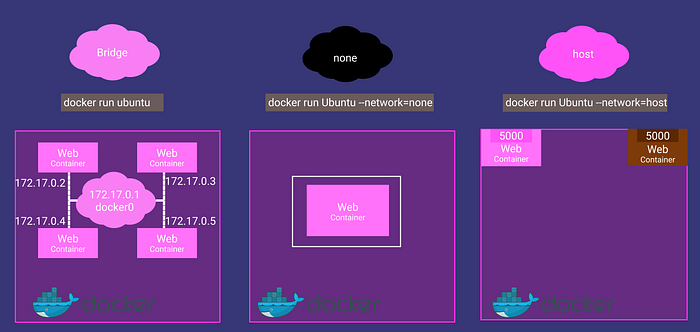
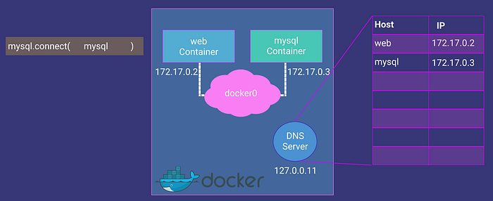
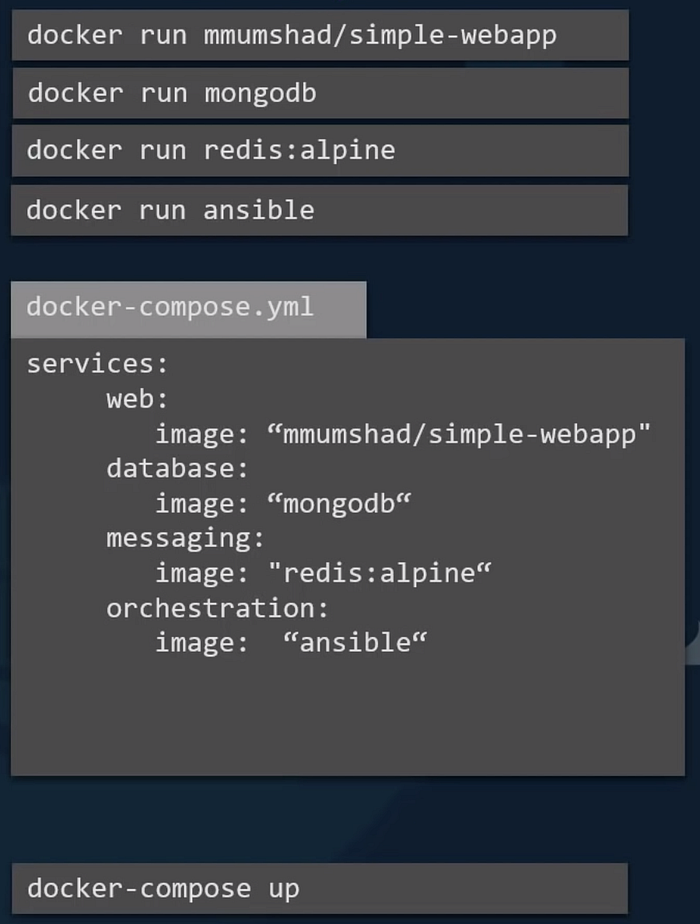
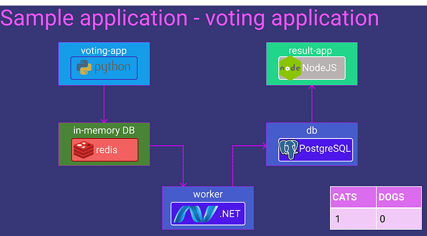
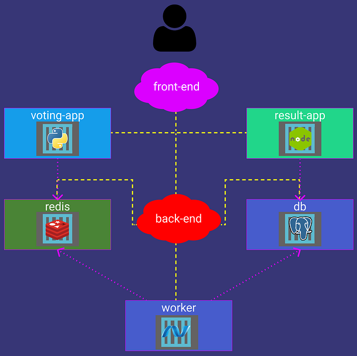

Some useful commands and concepts to use Docker

There is a Notion version of this article. You can add comments or duplicate it for yourself.

In this article, I‘ll talk about Docker. We will begin from why we need to use it, to how do we manage multiple Docker containers at the same time.

## Why do we need Docker?

We have web servers, database services, messaging services, etc. and all of them have their dependencies(libraries, OS version, etc.) and there can be a conflict between them. We call it “The matrix from Hell”.



The matrix from Hell

## What does docker do?

Run each component in a separate, isolated environment with its dependencies and its libraries. All within the same VM or host.

## What are the differences with VM?

VMs are complete isolation! They have their hardware, kernel, and OS. But docker containers use the same hardware and same Linux kernel.

> That is the reason why you can’t have a Windows container. You can say: “Hey! I have a docker on windows!”. Then I say, look for WSL. 😄
> 
> 
> Containers meant to run a specific task or process, not meant to host an OS.



Virtual Machines vs Containers

## Some Useful Docker Commands

1.   docker version: It gives the docker version.
2.   docker run: It is used to run a container from an image

*   docker run nginx ⇒ Runs instance of the Nginx application on the docker host
*   docker run **-d** nginx ⇒ Runs in the detached mode. That means the container will run in the background, and you can continue to use the terminal
*   docker run **— name webapp** nginx ⇒ Run a container with the given name
*   docker run**-it** nginx ⇒ “-i” gives stdin to docker, you can get input from the terminal. “-t” gives terminal so your dockerized app can print something
*   docker run **-v /opt/datadir:/var/lib/mysql** ….. ⇒ The container maps /var/lib/mysql**(in docker)** to /opt/datadir**(in your pc)**. Your data will persist even when you delete the container.
*   docker run **-p 80:5000** nginx ⇒ Forward your port 80 to container’s port 5000.

Note: You can’t bind the same host port to the multiple docker instances.



3. docker ps: List all running containers and several key information about them. If used with the “-a” parameter, you can see previously stopped or exited containers.

4. docker stop: It stops the running containers. Needs container ID or name.

*   docker stop silly_sammet

5. docker rm: Removes stopped or exited **container**permanently. If it prints the name back, we are good.

*   docker rm silly_sammet

6. docker images: Gives a list of downloaded images and their sizes.

7. docker rmi: Removes the **given image**. You need to remove all dependent containers before.

*   docker rmi nginx

8. docker pull: Just downloads the images so you won’t wait when you want to run the image.

9. docker exec: Execute a command in the container.

*   docker exec distracted_meclintock(container name) cat /etc/host(command)

10. docker inspect: It returns all details of the container in JSON format.

*   docker inspect webapp

11. docker logs: This shows the logs of a container. It is useful when your container runs in detached mode

## Tags

For example “docker redis” command will run the **latest** Redis version for you. What if you want to use an older version of Redis?

docker run redis**:4.0** bold part is the Tag of a container.

Where can I find tags of the docker image?

[hub.docker.com](http://hub.docker.com/)

**Environment Variables**

## How to create my own image?

Let’s say we have a webserver to run on an Ubuntu OS, what would be our steps to run it?

1.   OS — Ubuntu
2.   Update apt repo
3.   Install dependencies using apt
4.   Install Python dependencies using pip
5.   Copy source code to ex. /opt folder
6.   Run web server using ex. “flask” command

Then we need to do these steps in a file called Dockerfile.

```dockerfile
FROM Ubuntu 

RUN apt-get update 

RUN apt-get install python 

RUN pip install flask 

RUN pip install flask-mysql 

COPY . /opt/source-code 

ENTRYPOINT FLASK_APP = /opt/source-code/app.py flask run
```

Let’s build our Dockerfile and have a docker image!

```bash
docker build -t nusret/chatbot "Address of the dockerfile without double quote"
And push it to the DockerHub if you want

docker push nusret/chatbot
```

## What is this Dockerfile?



Dockerfile is a text file written in a specific format that docker can understand.



## How can I export/import my docker image as a tar file?

You can export your Docker Image as a .tar file with this command:

```bash
docker save —output chatbot.tar nusret/chatbot
```

And you can easily import it with a very similar command.

```bash
docker load —input chatbot.tar
```

### ENTRYPOINT VS CMD

Let’s say we have a docker container that just “sleeps” named “sleeper”. The docker file would be like this:

```dockerfile
FROM Ubuntu 

CMD ["sleep","5"]
```

When I run the command:

```bash
docker run sleeper sleep 10
```

This CMD command will get replaced with sleep 10. But as this is a sleeper container, I could only say “10” and the container must sleep. To do this we change the dockerfile like this:

```dockerfile
FROM Ubuntu 

ENTRYPOINT ["sleep"]
```

This time when I run:

```bash
docker run sleeper 10
```

The “10” will be appended to the “sleep” command and I can just set the sleep time. But what if I don’t write any number? How can I add a default sleep time?

```dockerfile
FROM Ubuntu 

ENTRYPOINT ["sleep"]

CMD ["5"]
```

## **Docker Networking**



1.   Default network a container gets attached to. A bridged network is a **private internal network created by docker on the host.**All containers are attached to this network and have their internal IP addresses. Containers can access each other by using these internal IPs. If you want to access any of these containers from the outside world, you need to bind/forward the host’s port to the ports on the Docker network
2.   Another way to access these containers is removing the network isolation between the docker host and the docker container by associating the container with the host’s network.
3.   In the “none” network, the container is not attached to any network, and it is not accessible from external networks or any other docker containers.

Containers can access each other using their names. Docker creates a DNS server that helps containers using each others’ names.



## Docker Compose



When we have a complex app that runs with multiple containers, we need to write lots of run commands! But we have docker-compose.

With the latest command at the bottom, you can run all of these images and more! We are using a .yaml file to configure docker-compose.

Let’s say we have a sample application like this:



What you would do without docker-compose:

```bash
docker run -d --name=redis redis docker run -d --name=db postgres:9.4 docker run -d --name=vote -p 5000:80 --link redis:redis voting-app docker run -d --name=result -p 5001:80 --link db:db result-app docker run -d --name=worker --link db:db --link redis:redis worker
```

With docker-compose, docker-compose.yml:

```yaml
redis: 

 image: redis 

db: 

 image: postgres:9.4 

vote: 

 image: voting-app 

 ports: 

 - 5000:80 

result: 

 image: result-app 

 ports: 

 - 5001:80 

worker: 

 image: worker
```

And run the command:

```bash
docker-compose up
```

What if some of the images are not already built or not in the DockerHub? Like the “voting-app” in our example, we can change the image key with a build key and specify a location of a directory that contains the application code and Dockerfile.

Change this code:

```yaml
vote: 

 image: voting-app 

 ports: 

 - 5000:80
```

To this code:

```yaml
vote: 

 build: ./vote 

 ports: 

 - 5000:80
```

## Docker Compose Versions

Docker-compose evolved over time and now supports a lot more options than it did in the beginning.

### Version 1

redis: 

 image: redis 

db: 

 image: postgres:9.4 

vote: 

 image: voting-app 

 ports: 

 - 5000:80 

 links: 

 - redis
It has several limitations. For example, if you wanted to deploy containers on a different network other than the default bridge network, there was no way of specifying that in this version of the file. Also, say you have a startup dependency or startup order of some kind. For example, your database container must come up first, and only then should the voting app be started. There was no way you could specify that in this version.

### Version 2

version: 2

services:

 redis: 

 image: redis 

 db: 

 image: postgres:9.4 

 vote: 

 image: voting-app 

 ports: 

 - 5000:80 

 depends_on: 

 - redis
Support for these came in version 2. With version 2 and up, the format of the file also changed. You no longer specify your stack information directly as you did before. It is all encapsulated in the services section.

Another difference is with networking. With version 2, docker-compose automatically creates a dedicated bridged network for this application and then attaches all containers to that new network. All containers are then able to communicate with each other using each other’s service name. So you don’t need to use links.

### Version 3

version: 3 

services: 

 redis: 

 image: redis 

 db: 

 image: postgres:9.4 

 vote: 

 image: voting-app 

 ports: 

 - 5000:80
This is the latest version of today. Version 3 comes with support for the docker swarm. There are some options removed and added. To see details:

## Networking in Docker Compose

Let us say we modify the architecture a little bit to contain the traffic from the different sources in separate networks. For example, we would like to separate the user-generated traffic from the application's internal traffic. So, we create a front-end network dedicated to the traffic from users and a backend network dedicated to the traffic within the application.



This is the .yaml file you need to write:

```yaml
version: 2 

services: 

 redis: 

 image: redis 

 networks: 

 - back-end 

 db: 

 image: postgres:9.4 

 networks: 

 - back-end 

 vote: 

 image: voting-app 

 ports: 

 - 5000:80 

 networks: 

 - front-end 

 - back-end 

 result: 

 image: result-app 

 ports: 

 - 5001:80 

 networks: 

 - front-end 

 - back-end 

 worker: 

 image: worker 

 networks: 

 - front-end: 

 - back-end:
```

So, that’s it! Please watch the video from FreeCodeCamp’s channel to get more detailed information. Also, take a look at the [KodeKlaud’s](https://www.youtube.com/user/mmumshad)channel!

::: {.medium-attribution}
Originally published on [Medium]().
:::

