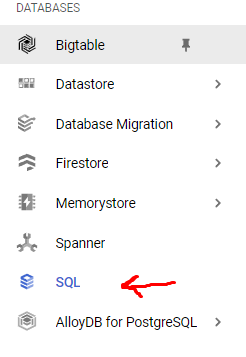
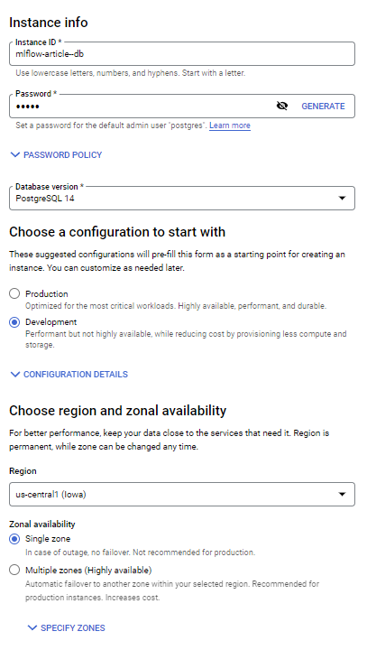
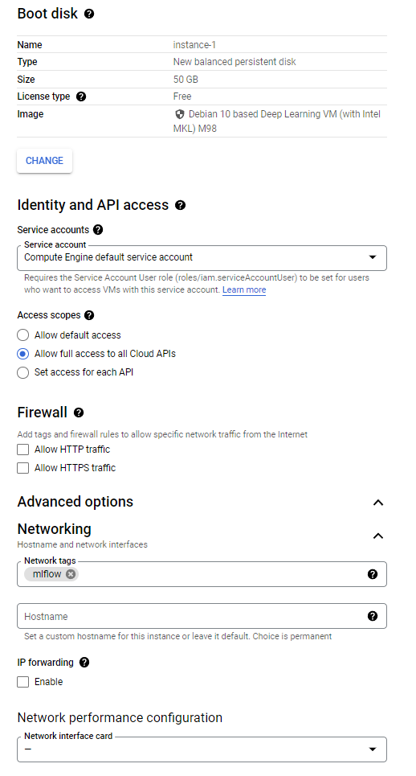
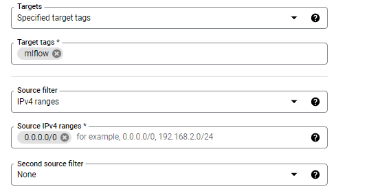
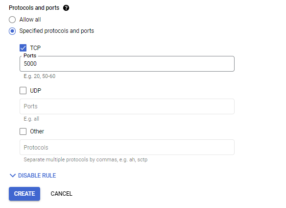

Photo by [Tobias Carlsson](https://unsplash.com/@tobias_carl?utm_source=medium&utm_medium=referral) on [Unsplash](https://unsplash.com/?utm_source=medium&utm_medium=referral)

As a machine learning engineer or a data scientist, you need to do experiments. Maybe you would try new models, new parameters, or new data preprocessing methods. When doing all of these in a Jupyter Notebook, it is very easy to get lost and forget the results you get from the experiments. When you are not alone and work with a team, you would like to see what others tried before maybe you don’t need to do any new experiments, or basically, you will not use unnecessary computing power to try what is tried before. To solve these problems MLFlow is with us! I will not go into details about MLFlow because I assume you are here because you already know it and want to use it in your team.

To install MLFlow on GCP we need to do 3 steps:

1.   Create a PostgreSQL DB for storing model metadata.
2.   Create a Google Cloud Storage Bucket for storing artifacts.
3.   Create a Compute Engine instance to install MLFlow and run the MLFlow server

## Database Creation

From the navigation bar, find SQL under the databases section and click on it, click on the “Create Instance” button and choose PostgreSQL.

SQL section in the navigation bar

Give an instance ID and password for the admin user. Choose development configuration because we don’t need something very fast. Choose a region that suits you. Lastly, in the customize your instance section, open the connections part and check the private IP option while unchecking the public IP. We don’t need to access this instance from outside. Compute engine VM will access it and it can use private IP. And click on “create instance”. It will take some time to finish.

You can go and do other sections instead of waiting but after it is completed come here again and inside your DB info go to the “Databases” menu and create a database called “mlflow”.

## Cloud Storage Creation

Go to the cloud storage from the navigation bar and create a new bucket. For naming, I generally start with the project ID and add a dash and add the name of the bucket. This will finish very quickly.

## Compute Engine Creation

Let’s go to the “Compute Engine” and click on the “Create Instance” button. Give it a name and choose a region. In the “Boot disk” section, click on the “Change” button and for the OS select “Deep Learning on Linux” (actually Ubuntu would be okay too, I think), and for the version select “Debian 10(whichever is latest at that time) based Deep Learning VM”. You can change the other settings however you want and click “Select”. In the “Identity and API, access” section choose “Allow full access to all Cloud APIs” under the “Access scopes”. In the advanced options, open the networking section and add the “mlflow” network tag and click create. We will use this tag later in the firewall rules.

This is how it should like at the end

After clicking on the “create” button you will be redirected to the main page and you can see there is a section called “Related actions”. Click “Set up firewall rules” then click “Create a firewall rule”. Give it a name and in the targets section, add mlflow in the target tags. For the IP ranges, “0.0.0.0/0” will allow everyone to access. If you don’t want that (yes, you don’t want that) get help from someone who knows about networking, or just type the unsafe option I said for testing or type your IP address and add a /32 after it such as “192.168.1.1/32”. To learn more about IP ranges [take a look](https://s3.amazonaws.com/tr-learncanvas/docs/IP_Filtering_in_Canvas.pdf).

Unsafe option

Then just choose TCP and port 5000 for the protocol and the port. We choose 5000 because it is what mlflow uses for its UI and server.

Now go back to compute engine and SSH into your machine using the UI( the option on the last column). In the terminal:

sudo apt update

pip3 install mlflow psycopg2-binary

mlflow server -h 0.0.0.0 -p 5000 --backend-store-uri postgresql://DB_USER:DB_PASSWORD@DB_ENDPOINT:5432/DB_NAME --default-artifact-root gs://GS_BUCKET_NAME
In our case:
## References

1.   [https://github.com/DataTalksClub/mlops-zoomcamp](https://github.com/DataTalksClub/mlops-zoomcamp)
2.   [https://s3.amazonaws.com/tr-learncanvas/docs/IP_Filtering_in_Canvas.pdf](https://s3.amazonaws.com/tr-learncanvas/docs/IP_Filtering_in_Canvas.pdf)
---

::: {.medium-attribution}
Originally published on [Medium]().
:::

