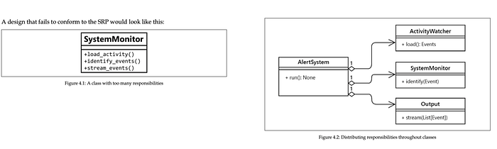

Photo by [NeONBRAND](https://unsplash.com/@neonbrand?utm_source=medium&utm_medium=referral) on [Unsplash](https://unsplash.com/?utm_source=medium&utm_medium=referral)

SOLID principles are a series of good practices that will make you write better quality software. This looks like a long article but actually it is not. Just the codes takes a little bit more space :)

> 💡 **SOLID** stands for:
> 
> 
> **S:** Single responsibility principle
> 
> 
> **O:** Open/Closed principle
> 
> 
> **L:** Liskov’s substitution principle
> 
> 
> **I:** Interface segregation principle
> 
> 
> **D:** Dependency inversion principle

## Single Responsibility Principle

For Turkish readers, I will summarize this principle with only one sentence: “Nerede çokluk orada ….”:)

A software component must have only one responsibility. It must have only one reason to change. If you need to modify the class for different reasons, this means something( an abstraction) is missing and you need to fix this. If a class has lots of responsibilities this class is often called a “God class” because they know too much or do too much, more than they should do. This type of class is very hard to maintain and the smaller the class, the better.

> _What we strive to achieve here is that classes are designed in such a way that most of their properties and their attributes are used by their methods, most of the time. When this happens, we know they are related concepts, and therefore it makes sense to group them under the same abstraction._

For example, when you look at the methods of the class and see there are some unrelated functions (with each other), you can tell that this class has to be broken down.



Take a loot at the `SystemMonitor` class. You can see there are three different reasons to make a change in this class. Maybe we decide to change how we load the activities, parse the events, or how we send the events (maybe we’ve decided to use Redis Streams instead of Kafka).

The picture on the right is better and reuseable. If we need to change something in how we load the data, we will only modify one class and the other classes will know nothing **if we do not break the contract**. Additionally, we can create an interface for let’s say loading events with a load function and we can use that interface to create classes with different loading codes (maybe loading from different sources). And we can use these classes as a plug-and-play.

The classes could have more than one method as long as they serve the same purpose.

> 💡 Try with one big monolithic class first and then try to separate it. This will help to get a clearer picture of the new abstraction that you need to create.

## Open-Closed Principle

A class must be open to extension but closed to modification. When we want to add new things to our model, we only want to add new things and not change anything existing that is closed to modification. This principle is very easy to understand with a concrete example. Let’s start with a bad example:

Why this is a bad example? Think about it for a second. How can you add an `Analyst` to this "Company"? Well, you can create a new class as a subclass of the `Employee` and then add one more if to Company’s work function. Well yes, it works but did you really like the solution? What will you do when new types of Employees come? This if-elif chain eventually will become hell and very hard to maintain. Now let’s see how we can fix this:

What changed? Now `Employee` is an abstract class and it has an abstract method called work. All subclasses of this class have to implement a work function. `Developer` calls its develop method and `Tester` calls its test method. In the company, all we had to do is calling the `work()` method of the given employee. If I need to add a new Employee like an Analyst, all I need to do is implement the `work()` method and done!

## Liskov’s Substitution Principle

The formal definition is:

> _if_ S _is a subtype of_ T _, then objects of type_ T _may be replaced by objects of type_ S _, without breaking the program._

I will begin with a rule special to Python and then show the general example. Why there is a special rule for Python? Because no one can stop you from doing this:

```python
class SuperClass:
    def check(name: str) -> str:
        return name


class SubClass(SuperClass):
    def check(name: dict) -> dict:
        return name


class AnotherSubclass(SuperClass):
    def check(name: str, surname: str) -> tuple:
        return name, surname
```
The program will work buuut… it will eventually crash somewhere. So, this is the special rule for Python because it allows doing this… How to protect yourself from these types of situations? The answer is holy python tool **mypy** and **pylint.** Both tools help you to find those mistakes and more!

## Interface Segregation Principle

Instead of one fat interface, create interfaces as small as possible based on a group of methods each one serving one submodule. For example, this is a bad example:

Why this is bad? Because what if a class that implements this interface doesn’t need to use the from_json method? Here we force a class to implement an interface they don’t want to use. The true approach is to create 2 different interfaces for those functions.

## Dependency Inversion

Let’s say you need to charge your phone. You would connect the adapter to the socket and it is done. You wouldn’t think about what is behind the wall and details of how you get the electricity (I mean if you are not an electrical engineer or something like that). This should be the case with your classes too. Your high-level classes (such as ActivityStreamer) should depend upon abstractions/interfaces, not concrete classes. Let’s give an example of bad practice:

What are the problems with that code?

1.   What if the name of the `write()` method changes? This class could be from a library or could be a class from the other team. Now you had to change your code when they change too because you depend on a concrete class in your high-level class.
2.   If we want to change the data destination for a different one or add new ones at runtime, we are also in trouble because we will find ourselves constantly modifying the `stream()` method to adapt it to these requirements.

How could we design our classes so that we could get rid of those problems?

Here we are depending on the abstraction using `EventSender`. Whatever subclass we get, we can just call `send()` method of this and we know that our event will be sent to the true place. And If we wanted to change the destination, we can just create a different subclass and give it in the `__init__()` method of `EventStreamer`.

I think that is all I can say! Thanks for reading!
## References

1.   Clean Code in Python — Mariano Anaya
2.   [https://www.youtube.com/watch?v=BLcnGmsZ5EE](https://www.youtube.com/watch?v=BLcnGmsZ5EE)
3.   [https://www.youtube.com/watch?v=i0qmhk41QVM](https://www.youtube.com/watch?v=i0qmhk41QVM)
4.   [https://www.youtube.com/watch?v=M6rwl_AZPJg](https://www.youtube.com/watch?v=M6rwl_AZPJg)
5.   [https://www.youtube.com/watch?v=onp6gcvVvIM](https://www.youtube.com/watch?v=onp6gcvVvIM)
---

::: {.medium-attribution}
Originally published on [Medium]().
:::


