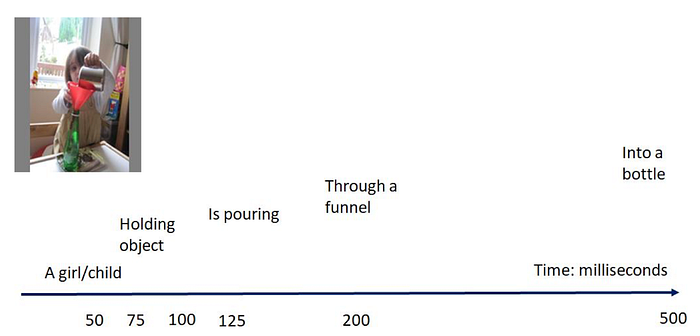
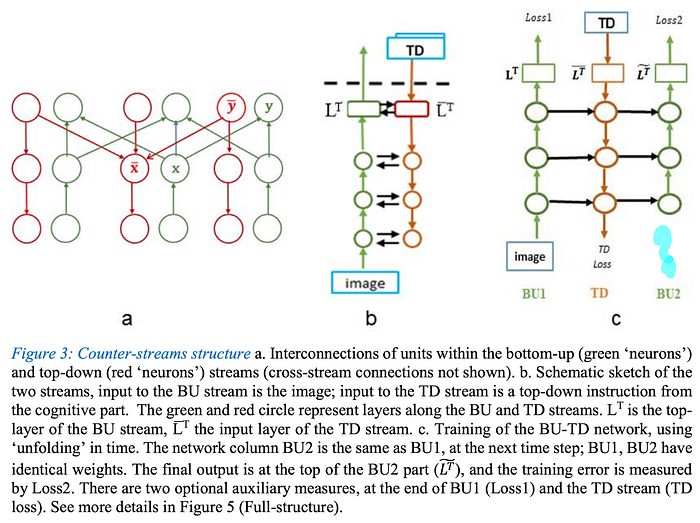
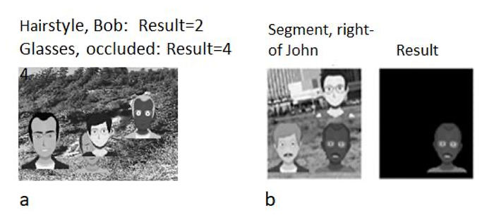

I have lots of things to do, but I’ve suddenly been struck by inspiration, and since the well-known work-avoidance mechanism has kicked in, I’m going to write down my thoughts on test-time compute, shared decoders, and reasoning. Here we go, a theoretical and lengthy piece is coming.

One of the things I love about LLMs is that they handle multiple tasks with a single loss and a single branch. That is, instead of a shared encoder + separate decoders for each task like in U-net models, there’s just a transformer decoder. As far as I know, this comes from T5 models where we model all NLP tasks as text-to-text. We’ll get back to LLMs in a bit, but let’s take a look at the vision side for now.

I don’t think there’s an equivalent of this in vision, for example, how would you combine segmentation and classification tasks? At the very least, the last layers would have to be different. However, there’s a model that comes very, very close to combining these, and the model’s developers are inspired by the human brain. The model is called BU-TD. Let’s start with the inspiration part. These folks are saying, ‘segmenting anything and everything at once’ is not the right approach; the human brain doesn’t work that way.

For example, the longer you look at the image above, the more details emerge; the brain doesn’t grasp the entire image with all its details at once. So why are we trying to make models do this? This is where BU-TD comes into play.

Again, in this model inspired by the human brain, first an encoder processes the image, and the decoder takes the vector coming from the encoder and additionally receives a task and argument vector. For example,

We tell the model to look at the image, task: find hairstyle, argument: bob. Afterwards, the decoder can optionally output the segmentation of Bob’s hair, but it may not; that part is a bit vague. By feeding the decoder’s result back into the encoder, we get the result corresponding to that style, and so on.

## **References**

1.   BU-TD Model: “Image interpretation by iterative bottom-up top-down processing” [https://arxiv.org/abs/2105.05592](https://arxiv.org/abs/2105.05592)
2.   T5 Model: “Exploring the Limits of Transfer Learning with a Unified Text-to-Text Transformer” [https://arxiv.org/abs/1910.10683](https://arxiv.org/abs/1910.10683)
---

::: {.medium-attribution}
Originally published on [Medium]().
:::

