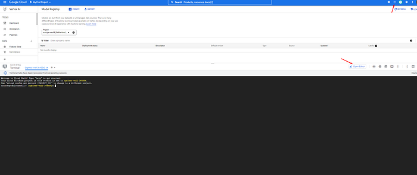

Vertex AI

TensorFlow

## Introduction

I believe that Google’s documentation is very hard to understand especially when it comes to Vertex AI. It took me days to create a hyperparameter-tuning job, get the best parameters, and train with these values. So, I’ve decided to write a medium post about it. It is a long journey and because of that, this will be a series of articles. The steps will be:

1.   Setting the infrastructure
2.   Uploading dataset
3.   Hyperparameter-tuning
4.   Training with the best parameters
5.   Deploying the model to an endpoint and getting the predictions

The final result will look like this

This is part 2 of Tuning and Deploying HF Transformers with Vertex AI. In this article, we will create our training image.

In [part 1](/posts/tuning-and-deploying-hf-transformers-with-vertex-ai-part-1/), we created the necessary GCP components.

In [part 3](/posts/tuning-and-deploying-huggingface-transformers-with-vertex-ai/), we will start hyperparameter-tuning, train with the best parameters, and deploy the model to get predictions.

We will create a file structure like this:

custom_training_docker/ 

├── trainer/ 

│ ├── __init__.py 

│ └── task.py 

└── Dockerfile
Now open the cloud shell and switch to editor mode to create these files.

Opening cloud shell

It is amazing, isn’t it?

task.py contains our training code and Dockerfile contains the necessary commands to dockerize our training code. Let’s start with task.py step by step. We will create our code considering [training code requirements by Google](https://cloud.google.com/vertex-ai/docs/training/code-requirements)

**model_dir**: Where we should save our model? Vertex AI automatically gives you a GCS path in the AIP_MODEL_DIR environment variable but you can use this argument to change the default value. I don’t recommend it because when you start to train your model, Vertex AI will look to the AIP_MODEL_DIR path to get the model and save it to the model registry.

We will use **learning rate** and **epochs**as hyperparameters.

**distribute**: It is to say if we want to train our model with multiple workers or a single worker with 1 GPU/CPU or a single worker with multiple GPUs.

Lastly, the bucket name and paths are necessary to download data from Google Cloud Storage.

Now that we get our arguments, we can set our strategy, create the tokenizer, and train our model.

Here the important part is we create our model inside the scope of the strategy. If we don’t do it like that, distributed training won’t work.

Now, we have 3 main methods to look at. These are get_model, get_data, and train.

### get_model()

> Yes, I know that I could create a TFAutoModelForSequenceClassification instead. But in this way, I can add more Dense layers after pooling.

As we need only 1 sentence for our task, we only need **“input_ids”** and **“attention_mask”**as the input. When we tokenize the data, we will use max length padding. Because of that, the shapes of the inputs are set to the model_max_length using the tokenizer.

## Resources

1.   [https://cloud.google.com/vertex-ai/docs/training/code-requirements](https://cloud.google.com/vertex-ai/docs/training/code-requirements)
2.   [https://codelabs.developers.google.com/vertex_multiworker_training](https://codelabs.developers.google.com/vertex_multiworker_training)
3.   [https://cloud.google.com/artifact-registry/docs/docker/pushing-and-pulling#auth](https://cloud.google.com/artifact-registry/docs/docker/pushing-and-pulling#auth)
---

::: {.medium-attribution}
Originally published on [Medium]().
:::

