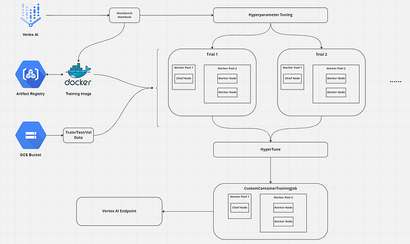

Vertex AI

TensorFlow

## Introduction

I believe that Google’s documentation is very hard to understand especially when it comes to Vertex AI. It took me days to create a hyperparameter-tuning job, get the best parameters, and train with these values. So, I’ve decided to write a medium post about it. It is a long journey and because of that, this will be a series of articles. The steps will be:

1.   Setting the infrastructure
2.   Uploading dataset
3.   Hyperparameter-tuning
4.   Training with the best parameters
5.   Deploying the model to an endpoint and getting the predictions

The final result will look like this

This is part 3 of Tuning and Deploying HF Transformers with Vertex AI.

In [part 1](/posts/tuning-and-deploying-hf-transformers-with-vertex-ai-part-1/), we created the necessary GCP components.

In [part 2](/posts/tuning-and-deploying-hf-transformers-with-vertex-ai-part-2/), we created model training and tuning code and wrap it into a docker container.

For looking at the whole code we will use check this [GitHub repository](https://github.com/NusretOzates/huggingface-gcp-classification).

Open your Jupyter Lab environment from Vertex AI or you can use Shell Editor and create a file `training.py` . You can change the name of course.

We begin with imports and some constants to initialize the AI Platform.

**PROJECT_NAME**: Your project name

**BUCKET_NAME**: Your Google Cloud Storage bucket name to save training metadata or saving models

**REPOSITORY_NAME**: Your Google Cloud Artifact Registry Docker Repository name

**LOCATION**: Where should training and tuning begin? If you followed the previous parts, this should be `europe-west4` . As all parts of the training will be in the same region, everything will be faster with reduced latency.

**IMAGE_URI**: URI of the training docker image to use

**TIMESTAMP**: We will use this when giving job names to train and tune models

To create `HyperparameterTuningJob` we need to create a `CustomJob` first.

CustomJob object needs 3 parameters: `display_name` ,`project_name` and `worker_pool_specs` . The first two are very simple to set. The last is still simple but it is longer.

Every worker pool needs to set three parameters. `machine_spec` , `container_spec` and `replica_count` .

### machine_spec

Which machine do you want to use for the workers in your worker pool? Do you want to use GPU in your workers and which one and how many? For choosing a suitable machine type and GPU type refer [here](https://cloud.google.com/vertex-ai/docs/predictions/configure-compute).

I’m broke and using the free trial of GCP. So I choose a basic machine without GPU :)

### container_spec

Which container do you want to use for your workers? And which command line arguments do you want to add to your container? We completed our dockerfile using `ENTRYPOINT` , remember? Now you can see that the reason is we want to “append” these arguments into the container.

### worker_pool_specs

Pay attention that this is not a dictionary, it is a list of dictionaries! It could have at most 4 elements and every element has a different responsibility. Directly from the source:

> Worker pool 0 configures the Primary, chief, scheduler, or “master”. In `MultiWorkerMirroredStrategy`, all machines are designated as workers, which are the physical machines on which the replicated computation is executed. In addition to each machine being a worker, there needs to be one worker that takes on some extra work such as saving checkpoints and writing summary files to TensorBoard. This machine is known as the chief. There is only ever one chief worker, so your worker count for worker pool 0 will always be 1.
> 
> 
> You can choose to add GPUs, but keep in mind that for `MultiWorkerMirroredStrategy` each machine in your cluster should have the same number of GPUs. Adding GPUs will also increase the cost of the training job.

And worker pool 1 is where you configure the workers for your cluster.

## Resources

1.   [https://cloud.google.com/vertex-ai/docs/predictions/configure-compute](https://cloud.google.com/vertex-ai/docs/predictions/configure-compute)
2.   [https://codelabs.developers.google.com/vertex_multiworker_training#5](https://codelabs.developers.google.com/vertex_multiworker_training#5)
3.   [https://towardsdatascience.com/why-is-the-log-uniform-distribution-useful-for-hyperparameter-tuning-63c8d331698](https://towardsdatascience.com/why-is-the-log-uniform-distribution-useful-for-hyperparameter-tuning-63c8d331698)
4.   [https://stats.stackexchange.com/questions/467372/scale-selection-for-the-hyperparameters](https://stats.stackexchange.com/questions/467372/scale-selection-for-the-hyperparameters)
5.   [https://www.youtube.com/watch?v=sBhEi4L91Sg&ab_channel=KhanAcademy](https://www.youtube.com/watch?v=sBhEi4L91Sg&ab_channel=KhanAcademy)
6.   [https://towardsdatascience.com/a-conceptual-explanation-of-bayesian-model-based-hyperparameter-optimization-for-machine-learning-b8172278050f](https://towardsdatascience.com/a-conceptual-explanation-of-bayesian-model-based-hyperparameter-optimization-for-machine-learning-b8172278050f)

::: {.medium-attribution}
Originally published on [Medium]().
:::

