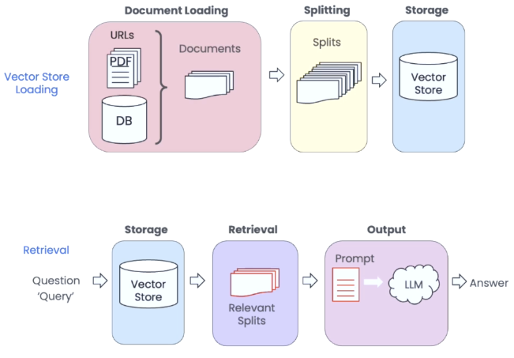
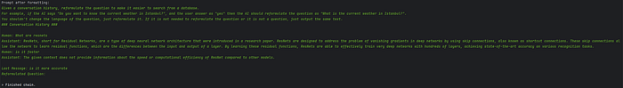
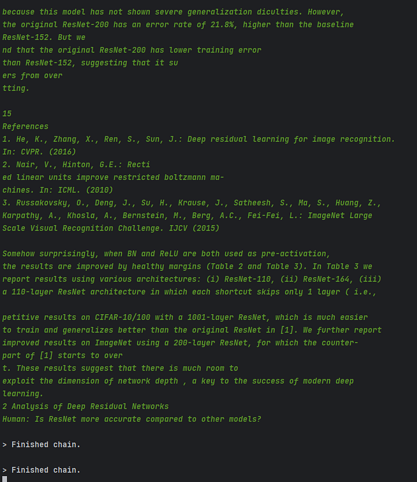

In a revolutionary breakthrough, the boundaries of AI-driven Question Answering (QA) Chatbots have been shattered. Imagine a QA Chatbot that requires zero training and can effortlessly handle complex queries like a seasoned expert. The ultimate combination of cutting-edge technologies: Streamlit, Langchain Retrieval QA, and ChatGPT, culminating in an awe-inspiring AI-powered experience like never before. I will share the code at the end.

Let's talk about these 3 leading technologies:

### Streamlit

Well if you are a Python developer, an AI expert, etc. you probably need to improve at the design side of the things like me. Streamlit comes to your help for these times.

> Streamlit turns data scripts into shareable web apps in minutes.
>
> All in pure Python. No front-end experience required.

### Langchain

We will talk more about this. I will drop the official introduction below:

LangChain is a framework for developing applications powered by language models. It enables applications that are:

* Data-aware: connect a language model to other sources of data
* Agentic: allow a language model to interact with its environment

The main value props of LangChain are:

1. Components: abstractions for working with language models, along with a collection of implementations for each abstraction. Components are modular and easy to use, whether you are using the rest of the LangChain framework or not
2. Off-the-shelf chains: a structured assembly of components for accomplishing specific higher-level tasks

Off-the-shelf chains make it easy to get started. For more complex applications and nuanced use cases, components make it easy to customize existing chains or build new ones.

### ChatGPT

We all know this part… So let's start building!

## Data Loading

To answer questions, we need something to look at. Langchain has tons of different data loaders in `langchain.document_loaders`. We will use only three of them.

```python
from langchain.document_loaders import PyPDFLoader, TextLoader, UnstructuredURLLoader
```

**PyPDFLoader:** It reads the pdf file, and creates a `Document` object for every page. You need to install the `pypdf` library to use it.

**TextLoader:** It reads the contents of a txt file, and creates a `Document` object.

**UnstructuredURLLoader:** It reads the body of the URL and returns every element as a doc. You need to install `unstructured` and `python-magic` libraries to use this class. If you are on Windows install `python-magic-bin` too.

Loading pdf and text files is very easy and similar:

```python
def load_text_file(file_path: str) -> Document:
    doc = TextLoader(file_path, encoding="utf-8").load()[0]
    return doc


def load_pdf_file(file_path: str) -> list[Document]:
    loader = PyPDFLoader(file_path)
    docs = loader.load()
    return docs
```

Website loading is a little bit longer because we need to post-process it because they are mostly full of irrelevant text that needs to go to the trash.

```python
def load_website(url: str) -> list[Document]:
    """Load a website and return cleaned document chunks."""
    doc = UnstructuredURLLoader(
        [url],
        mode="elements",
        headers={"ssl_verify": "False"},
    ).load()
    processed_docs = []
    for i in range(len(doc)):
        if doc[i].metadata.get("category") not in [
            "NarrativeText",
            "UncategorizedText",
            "Title",
        ]:
            continue
        if doc[i].metadata.get("links"):
            link = doc[i].metadata["links"][0]["text"]
            if link is None:
                continue
            link = link.replace(" ", "").replace("\n", "")
            if len(link.split()) == 0:
                continue
        if doc[i].metadata.get("category") == "Title" and doc[i].metadata.get("links"):
            continue
        doc[i].page_content = re.sub(" +", " ", doc[i].page_content)
        if len(doc[i].page_content.split()) < 3:
            continue
        processed_docs.append(doc[i])
    merged_docs = "\n".join([doc.page_content for doc in processed_docs])
    splitter = RecursiveCharacterTextSplitter(chunk_size=1000, chunk_overlap=100)
    processed_docs = splitter.split_text(merged_docs)
    return [Document(page_content=doc, metadata={"url": url}) for doc in processed_docs]
```

To summarize the steps quickly:

1. Read the HTML
2. Filter all elements that are not meaningful text
3. Filter all elements that contain links with empty text
4. Remove all extra spaces and filter out all elements with less than 3 words
5. Merge all texts and split them into chunks

Okay, we load the data what's next? Before continuing, we will learn about a prompting technique.

## Retrieval Augmented Generation



We're facing two primary issues. Firstly, LLMs such as ChatGPT have difficulty reading lengthy texts, and even if they can, it's an expensive process. Additionally, irrelevant details in the text can add noise and reduce answer quality, making it a waste of money. Secondly, LLMs tend to generate false information, which can lead to incorrect answers. To address these issues, we aim to provide only the essential context in the prompt and restrict the model to use only this context to answer the question.

## Data Indexing

After we split our data into chunks, we can store it in a vector store.

```python
from langchain.indexes import VectorstoreIndexCreator
from langchain.vectorstores import DocArrayInMemorySearch
from langchain.vectorstores.base import VectorStoreRetriever


def create_index(docs: list[Document]) -> VectorStoreRetriever:
    """Create a vectorstore index from a list of Document objects."""
    index = VectorstoreIndexCreator(
        vectorstore_cls=DocArrayInMemorySearch,
        text_splitter=RecursiveCharacterTextSplitter(chunk_size=1000, chunk_overlap=100),
    ).from_documents(docs)
    return index.vectorstore.as_retriever(search_type="mmr")
```

`VectorstoreIndexCreator` automatically creates embeddings of the documents using `OpenAIEmbeddings` and stores the embeddings in memory.

> To make this article not too long, I will not show the prompts here but we have 1 prompt. It is for generating the question that is suitable for searching in the vector store using the conversation history.

## Model Creation

We have documents, we have a vector store and we have our prompts. Now let's put them together and create our bot.

```python
from langchain.chat_models import ChatOpenAI
from langchain.chains import ConversationalRetrievalChain
from langchain.prompts import PromptTemplate
from prompts import QUESTION_CREATOR_TEMPLATE


@st.cache_resource
def load_chain(file_name: str, file_type: str):
    if file_type == "text/plain":
        docs = load_text_files([file_name])
    elif file_type == "application/pdf":
        docs = load_pdf_files([file_name])
    elif file_type == "text/html":
        docs = load_website(file_name)
    else:
        st.write("File type is not supported!")
        st.stop()
    retriever = create_index(docs)
    condense_question_prompt = PromptTemplate.from_template(QUESTION_CREATOR_TEMPLATE)
    chain = ConversationalRetrievalChain.from_llm(
        ChatOpenAI(model_name="gpt-3.5-turbo", temperature=0),
        retriever,
        condense_question_llm=ChatOpenAI(model_name="gpt-3.5-turbo"),
        condense_question_prompt=condense_question_prompt,
        verbose=True,
    )
    return chain
```

`st.cache_resource` is used to cache the embeddings and our LLM in memory to not create embeddings again and again.

`PromptTemplate` is used to insert the necessary context and the question to the prompt.

`ChatOpenAI` will be used as the LLM. The default model is `gpt-3.5-turbo`. One LLM is used to create an answer and the other one will be used to create the standalone question to make searching better. I didn't like the prompt to create the question so changed it to a better prompt.

`verbose` will print out what is behind the scenes.





Lastly, to create meaningful questions, we need to know about our chat history. There are lots of ways to store memory:

1. Saving all the conversation
2. Saving last `k` messages
3. Creating a summary after `k` messages/tokens
4. …

In this example, we will use the second one. We generally only need the last 3 messages to get the context and create questions. No need to use our money for more.

```python
from langchain.memory import ConversationBufferWindowMemory


def load_memory(st) -> ConversationBufferWindowMemory:
    """Load memory from session state."""
    memory = ConversationBufferWindowMemory(k=3, return_messages=True)
    if "messages" not in st.session_state:
        st.session_state["messages"] = [
            {"role": "assistant", "content": "How can I help you?"}
        ]
    for index, msg in enumerate(st.session_state.messages):
        st.chat_message(msg["role"]).write(msg["content"])
        if msg["role"] == "user" and index < len(st.session_state.messages) - 1:
            memory.save_context(
                {"input": msg["content"]},
                {"output": st.session_state.messages[index + 1]["content"]},
            )
    return memory
```

It takes a streamlit object as input. Check if there is a message from the last session. If yes load them to the memory, otherwise start with a welcome message. We will give this history to the model when we call it with user input.

```python
import os
import streamlit as st

os.environ["OPENAI_API_KEY"] = "<YOUR_OPENAI_API_KEY>"

st.set_page_config(layout="wide")
st.title("💬 QA Chatbot")
uploaded_file = st.file_uploader("Choose a file", type=["txt", "pdf"])
st.header("Or you can give a url")
url = st.text_input("Url to parse")

if uploaded_file is not None or url:
    if uploaded_file:
        with open(uploaded_file.name, "wb") as f:
            f.write(uploaded_file.getbuffer())
        chain = load_chain(uploaded_file.name, uploaded_file.type)
    else:
        chain = load_chain(url, "text/html")
    st.write("## 🤖 Chatbot is ready to answer your questions!")
    memory = load_memory(st)
    if question := st.chat_input():
        st.session_state.messages.append({"role": "user", "content": question})
        st.chat_message("user").write(question)
        response = chain(
            {
                "question": question,
                "chat_history": memory.load_memory_variables({})["history"],
            }
        )
        answer = response["answer"]
        st.session_state.messages.append({"role": "assistant", "content": answer})
        st.chat_message("assistant").write(answer)
```

And we are done! You can check the code from the [GitHub repository](https://github.com/NusretOzates/langchain_retrieval_qa_bot) and ask any questions you have!

## Resources

1. [Retrieval-Augmented Generation (Meta)](https://ai.meta.com/blog/retrieval-augmented-generation-streamlining-the-creation-of-intelligent-natural-language-processing-models/)
2. [Prompting Guide](https://www.promptingguide.ai/)
3. [LangChain docs](https://python.langchain.com/docs/get_started/introduction)
4. [Streamlit](https://streamlit.io/)
5. [OpenAI docs](https://platform.openai.com/docs/introduction)
